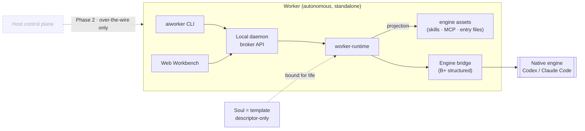

<div align="center">

# AIWorker

**自律的でローカルファーストな AI worker を起動 —— Soul テンプレートをネイティブエンジンにバインドするだけで、自己ホスト型の Web Workbench を備えたランタイムが手に入ります。**

[](https://www.npmjs.com/package/@zonease/aiworker-cli)
[](https://github.com/ZonEaseTech/aiworker/actions/workflows/lint.yml)
[](https://github.com/ZonEaseTech/aiworker/actions/workflows/release.yml)
[](./LICENSE)
[](https://github.com/ZonEaseTech/aiworker/blob/main/package.json)
[](https://github.com/ZonEaseTech/aiworker/commits)
[](https://bun.sh)
[](https://www.typescriptlang.org)

[English](./README.md) · [简体中文](./README.zh-CN.md) · **日本語**

</div>

> [!NOTE]
> **ステータス:`0.x` プレビュー。** v1 は**スタンドアロン Worker** のみを提供します。Host コントロールプレーンは **Phase 2** であり、ランタイムのホットパス上には決して現れません。以下のアーキテクチャが正式な契約です —— [`docs/architecture.md`](./docs/architecture.md) を参照してください。

AIWorker は **worker 中心・ローカルファーストの AI ランタイム**です。**Worker** は自律的で CLI-first なプロセスであり、**ネイティブエンジン**(Codex / Claude Code)を通じて 1 つの **Soul** を実行し、エンジン起動権を所有し、自身の Web **Workbench** を提供します。クラウドバックエンドもコントロールサーバーも不要 —— 1 つのコマンドで、自己ホスト型の AI worker をあなたのマシン上に立ち上げられます。

- 🧍 **Worker 中心** —— 各 Worker は自律的な CLI-first ランタイムで、作成時に 1 つの Soul にバインドされ*生涯変わりません*。エンジン起動権を所有し、Host が不在でも完全にスタンドアロンで動作します。
- 🧩 **Soul = テンプレート** —— descriptor-only のエンジンアセット束(workspace ファイル、skills、ネイティブ MCP ファイル、`AGENTS.md` / `CLAUDE.md` などの entry ファイル)。UI も、アプリ固有 API も、ロックインもありません。一度作成すれば、対応する任意のエンジンへ投影できます。
- 🖥️ **自身の Workbench を所有** —— Worker は自身の Web UI(workspace、session、chat)を直接レンダリングします。mounted micro-app も Soul 提供の UI もありません。
- 🔌 **ネイティブエンジンブリッジ** —— 構造化ブリッジを通じてエンジンを駆動します(プロセス管理、秘匿化、キャンセル、再アタッチ、リコンサイル)。モデル呼び出し、tool loop、承認、サンドボックス、認証はすべてエンジンが所有し続けます。
- 🔒 **ローカルファーストかつ秘密情報セーフ** —— 単一のローカル daemon、SQLite メタデータ、そして厳格な秘匿化境界:秘密情報が descriptor・DB・ログ・receipt・UI に入ることは決してありません。
- ⚡ **ゼロコンフィグ起動** —— `bunx @zonease/aiworker-cli start` が DB・内蔵 Freeform Soul・Worker の bootstrap を行い、Workbench を開きます。

---

## 目次

- [AIWorker とは?](#aiworker-とは)
- [対象ユーザー](#対象ユーザー)
- [メンタルモデル](#メンタルモデル)
- [アーキテクチャ](#アーキテクチャ)
- [クイックスタート](#クイックスタート)
- [初回起動](#初回起動)
- [Soul を作成する](#soul-を作成する)
- [Monorepo 構成](#monorepo-構成)
- [開発](#開発)
- [テストとリリースゲート](#テストとリリースゲート)
- [ロードマップ](#ロードマップ)
- [ドキュメントマップ](#ドキュメントマップ)
- [コントリビュート](#コントリビュート)
- [ライセンス](#ライセンス)

## AIWorker とは?

ほとんどの AI ツールは、開発者向け IDE/agent か、レンタル型のクラウドプラットフォームのどちらかです。AIWorker はそのどちらでもありません。AIWorker は**ランタイム層**です ——*1 つのエンジン + 1 つのテンプレート*を、あなたが所有しローカルで動かす、独立した自己ホスト型の **AI worker** に変えます。

責務の分離は厳格であり、それこそが本質です:

| レイヤー | 所有するもの | 所有**しない**もの |
| --- | --- | --- |
| **Worker** | ローカル daemon、Workbench web、workspace、session、projection、エンジン起動、ストレージ、秘匿化 | モデル呼び出し、tool loop、承認、サンドボックス |
| **Soul**(テンプレート) | エンジンアセット:workspace ファイル、skills、ネイティブ MCP、entry ファイル | UI、API、capability、ドメインバックエンド |
| **ネイティブエンジン** | モデル呼び出し、tool loop、承認、サンドボックス、認証、native session | workspace の特定、Worker 状態の永続化 |
| **Host**(*Phase 2*) | 配布、管理、権限割り当て、connector 認可 | session、invocation、projection、エンジンプロセス、秘密情報 |

Worker はランタイム時に Host に依存することは決してなく、`worker-*` パッケージが `host-*` パッケージを import することも決してありません —— この自律境界はコードレベルで強制されています。

## 対象ユーザー

AIWorker は、**一人の専門家の能力をチーム全体に複製したい**組織のために作られています —— 知見のある作者が専門能力を Soul としてパッケージ化し、各従業員はすぐ使える専属の AI Worker を手にします。垂直的・組織的なワークフローのための**ローカルで自己完結する AI worker** であり、**また別の**開発者 IDE やレンタル型 agent プラットフォームではありません。

作者が任意の垂直職能向けに Soul を作成すれば、各従業員の Worker はそれをスタンドアロンで実行します:

- **PM** —— PRD、意思決定記録、roadmap スライス、ステータスレポート
- **品質** —— テスト計画、回帰マトリクス、欠陥エビデンス、release gate
- **People ops** —— 候補者スクリーニング、面接ブリーフ、役割ルーブリック、採用リスク
- **DevOps** —— デプロイチェックリスト、インシデントレビュー、runbook 更新、キャパシティサマリ
- **財務 / 法務 / 運用** —— 各領域のレビュー、テンプレート化された出力、エビデンスチェーン

組織側の複製レバー —— 発行、割り当て、ロールアウト、ロールバック —— は Phase 2 の Host です。v1 は基盤としてスタンドアロンの Worker を提供します。v1 唯一の受け入れ用 Soul **`aiworker-freeform`** が完全なスタンドアロンループを証明します。HR と QA の Soul は、その後 descriptor-producing なテンプレートとして追加されます。

## メンタルモデル

5 つの名詞、1 つの方向:

```text
Worker → Workbench → workspace → session (chat) → native engine
```

| 概念 | 内容 |
| --- | --- |
| **Worker** | 自律的で CLI-first なランタイム。作成時にちょうど 1 つの Soul にバインドされます(生涯固定)。自身のローカル daemon を起動し、Workbench を提供し、projection と engine bridge を所有し、ネイティブエンジンを起動・観測し、ローカル broker API を公開します。 |
| **Soul** | **テンプレート**の人間向けの呼び名 —— descriptor-only のエンジンアセット束。UI も API も capability 層もありません。`dist/soul.descriptor.json` 経由でインストールします。 |
| **Workbench** | Worker 自身の Web UI(`apps/worker-web` 内、`packages/ui` から構築)。workspace、その下にネストされた session、session chat、そして Worker 自身の設定を管理します。 |
| **Workspace** | Worker 配下のビジネススコープ(例:1 人の候補者、1 つの release、1 件の incident)。そのルートは Worker home 配下に派生します —— 任意の repo パスではありません。 |
| **Session** | 1 つの workspace に対する chat —— composer と transcript。ライフサイクル:`active │ archived │ deleted`。最初の composer メッセージが session の最初の invocation になります。 |
| **Engine invocation** | Worker が所有する実行/プロセス状態で、session ライフサイクルとは分離されています。Follow-up は session レベル:`POST /api/sessions/:sessionId/invocations`。 |
| **Engine bridge** | B+ 構造化ネイティブブリッジ:エンジンごとの adapter(Codex、Claude Code)、プロセス管理、秘匿化された raw chunk、正規化イベント、不透明な session ref、キャンセル、再アタッチ、リコンサイル。 |

## アーキテクチャ



**daemon トポロジは Worker ごとに 1 つの daemon です。** Worker daemon は最大 1 つの active Worker をホストし、fleet/Host への認識をまったく持ちません —— 自身の CLI、Workbench web、設定だけを提供する受動的なローカルサーバーです。Phase 2 では、Host はトランスポート非依存の制御契約を over-the-wire で駆動し、従業員を Worker 自身の Workbench URL へ誘導できますが、その Workbench を mount / frame / embed / render / proxy することは一切ありません。Host の有無にかかわらず、Worker は純粋なまま、同一に振る舞います。

## クイックスタート

> **前提条件:** [Bun](https://bun.sh) `>=1.1`(推奨)または Node.js `>=20.19`。`local-cli` パスには `PATH` 上にネイティブエンジン([Codex](https://github.com/openai/codex) または [Claude Code](https://www.anthropic.com/claude-code))が必要です。無い場合は BYOK フォールバックが適用されます。

パッケージ済みの CLI を実行すると、すべてを bootstrap して Workbench を開きます:

```bash
bunx @zonease/aiworker-cli start --port 9217
# または npm の runner を使う場合:
npx @zonease/aiworker-cli start --port 9217
```

`aiworker start` は、内蔵 Freeform Soul にバインドされた active Worker が 1 つ存在することを保証し(存在しなければ descriptor をインストールして Worker を作成、存在すれば再利用)、ローカル daemon をバックグラウンドで起動し、Workbench URL を開きます。

<details>
<summary><b>その他のライフサイクルコマンド</b></summary>

```bash
aiworker daemon start --port 9217        # 同じサービス、バックグラウンド、ブラウザを開かない
aiworker daemon foreground --port 9217   # 同じサービス、現在のプロセス、ブラウザを開かない
aiworker daemon status                   # daemon ステータスを表示
aiworker daemon logs --tail 100          # daemon ログを表示
aiworker daemon restart --port 9217      # Worker を保証 + サービス再起動
aiworker daemon stop                     # daemon を停止
aiworker doctor                          # ローカル daemon の準備状況を確認
```

すべての service-start コマンドは Worker 準備層において冪等です。公開パスのサービスポートは 1 つだけで、`5173` は source-checkout の Vite dev server にのみ属します。

</details>

## 初回起動

Workbench が開くと、スタンドアロン Worker にはすでに Freeform にバインドされた active Worker が存在します —— Worker 作成や Soul カタログの UI は**ありません**。空状態*こそが*初回起動体験です:

1. 空の Workbench は、名前を付けて**最初の workspace を作成**するよう促します(そのルートは Worker home 配下に派生)。
2. session の無い workspace は、**最初の session を開始**するよう促します。
3. session は空の chat を開き、あなたの**最初のメッセージ**が最初のエンジン invocation になります。Follow-up は同じ session 上に留まります。

Settings は明示的なボタンから開き、Local CLI / BYOK、エンジンスキャン&テスト、connectors、MCP、言語、外観、autosave をカバーします。

`AIWORKER_HOME` は、パッケージ CLI では `~/.aiworker`、source checkout では `~/.aiworker-dev` がデフォルトです。いずれも `AIWORKER_HOME=<path>` で上書きできます。

## Soul を作成する

Soul は SDK で作成し、CLI-first です。30 秒のパス:

```bash
aiworker soul create my-soul                 # ./my-soul に scaffold(descriptor もビルド)
cd my-soul
aiworker soul build                          # 編集後に再ビルド → dist/soul.descriptor.json
aiworker app install dist/soul.descriptor.json
aiworker worker create --app my-soul         # Worker を Soul にバインド
```

Soul は**エンジンアセットのみ**のテンプレートです —— `web/` も `api/` も capability もありません。SDK は一般的な作成レイアウトを規約で発見します:

```text
my-soul/
  soul.config.ts            # identity + 明示的なオーバーライド
  engine/
    workspace/              # 投影される workspace ファイル
    skills/                 # 投影される skills
    mcp/
      codex/config.toml     # エンジンターゲットごとのネイティブ MCP
      claude-code/.mcp.json
```

完全な作成契約は [`docs/soul-authoring.md`](./docs/soul-authoring.md) を、SDK インターフェースは [`packages/soul-sdk`](./packages/soul-sdk) を参照してください。

## Monorepo 構成

```text
apps/
  worker-cli/    aiworker CLI + パッケージ済みローカル daemon エントリ
  worker-web/    Worker 所有の Workbench web(workspace、session、chat)
  host-cli/      Phase 2 コントロールプレーンのシェル (休眠スタブ)
  host-web/      Phase 2 コントロールプレーンのシェル (休眠スタブ)

souls/
  aiworker-freeform/   v1 強受け入れ descriptor Soul

packages/
  worker-runtime/           Worker locator/runtime オーケストレーション + エンジン adapter
  worker-daemon/            ローカル broker API + Workbench web ホスト
  soul-descriptor/          descriptor フォーマット + 検証 (soul/v1)
  soul-sdk/                 Soul 作成 SDK + descriptor ビルド
  engine-bridge/            B+ ネイティブエンジン bridge(adapter、プロセス、イベント、秘匿化)
  engine-projection/        descriptor + overlay からエンジン可視ファイルを物化
  storage-sqlite/           worker.db スキーマ、migrations、repositories
  fs-layout/                AIWORKER_HOME / worker / workspace パスヘルパー
  ui/                       shadcn 管理の共有 UI プリミティブ + テーマ
  host-control/             Phase 2 コントロールプレーン            (休眠スタブ)
  worker-control-protocol/  Phase 2 Host↔Worker 制御契約 (休眠スタブ)
```

> 境界は荷重を担います:`apps/*` は実行可能なプロダクトシェル、`souls/*` は descriptor-producing なテンプレート、パッケージ名は plane プレフィックス付き(`worker-*` は自律ランタイム、`host-*` は休眠中の Phase 2 コントロールプレーン)。`worker-*` パッケージは `host-*` パッケージを import してはなりません。

## 開発

```bash
bun install        # workspace の依存関係をインストール
bun run dev        # source-checkout 開発:web を一度ビルドし、daemon をフォアグラウンド実行
```

<details>
<summary><b>一般的なチェックとフォーカスビルド</b></summary>

```bash
bun run typecheck   # すべての workspace
bun run lint        # eslint + 境界 + ui + docs チェック
bun run test        # すべての workspace テスト
bun run check       # typecheck + lint
bun run build       # worker-daemon + worker-web + CLI バンドル

# フォーカス
bun run --filter '@zonease/aiworker-worker-runtime' test
bun run --filter '@zonease/aiworker-worker-web' build
bun run --filter '@zonease/aiworker-cli' build:bundle
```

`dev` スクリプトを使わない source checkout —— web アセットを一度ビルドし、daemon をフォアグラウンドで実行します:

```bash
bun run --filter '@zonease/aiworker-worker-web' build
bun apps/worker-cli/src/aiworker.ts daemon foreground --port 9217
```

</details>

## テストとリリースゲート

契約テストが主要なガードレールです —— 大量の歴史的 E2E ではなく、フォーカスされた静的・ユニット・パッケージ・CLI・ブラウザの証明を重視します。アグリゲータは:

```bash
bun run release:check
```

これは順に実行します:`docs:check` → `test:contracts` → `test:protocol` → `test:cli` → `test:browser:freeform` → `typecheck` → `lint` → `build` → リリース smoke(`dist-release`、`standalone-release`、`standalone-runtime`、`npm-package`)→ `test` → `check`。v1 のブラウザ証明は Freeform のみ、かつスタンドアロンです。[`docs/testing.md`](./docs/testing.md) を参照してください。

## ロードマップ

| フェーズ | スコープ |
| --- | --- |
| **v1 —— 現在** | スタンドアロン Worker · `aiworker-freeform` Soul · worker が Workbench を所有 · ネイティブエンジン bridge(Codex / Claude Code)· ゼロコンフィグ `aiworker start` · BYOK フォールバック |
| **Phase 2 —— Host コントロールプレーン** | オプションの 配布 / 管理 / 権限割り当て / connector 認可 · Worker 発の check-in と Worker Access tunnel · トランスポート非依存の制御契約。ランタイムのホットパス上には決して現れません。 |
| **その先** | HR、QA、およびさらなる垂直 Soul を descriptor-producing テンプレートとして再作成 |

## ドキュメントマップ

5 つの canonical ドキュメントが唯一の正です。古いノートはエビデンスにすぎません。

| ドキュメント | 所有するもの |
| --- | --- |
| [`AGENTS.md`](./AGENTS.md) | Agent bootstrap、プロダクト/monorepo/protocol/runtime の境界 |
| [`docs/architecture.md`](./docs/architecture.md) | アーキテクチャ契約、ownership、monorepo 境界、移行ルール |
| [`docs/protocol.md`](./docs/protocol.md) | Descriptor v1、broker routes、Phase 2 制御契約 |
| [`docs/runtime.md`](./docs/runtime.md) | session ライフサイクル、engine invocation、bridge、projection、秘密情報境界 |
| [`docs/soul-authoring.md`](./docs/soul-authoring.md) | SDK 作成、規約発見、ビルド出力、ネイティブ MCP |
| [`docs/testing.md`](./docs/testing.md) | カバレッジ台帳、ガードレール、リリースゲート、ブラウザ証明の範囲 |

## コントリビュート

issue と PR を歓迎します。PR を出す前に:

1. [`AGENTS.md`](./AGENTS.md) と関連する canonical ドキュメントを読んでください —— ドキュメントが正であり、コードはそれに従います。
2. 変更を現在のフェーズにフォーカスさせ、触れた範囲にフォーカスした契約テストを追加してください。
3. push する前に `bun run check` を実行してください(ランタイムに影響する変更は `bun run release:check` も)。
4. commit、コメント、PR 説明はデフォルトで中国語を使用してください(そうしない理由がある場合を除く)。

## ライセンス

[MIT](./LICENSE) © ZonEase Tech
