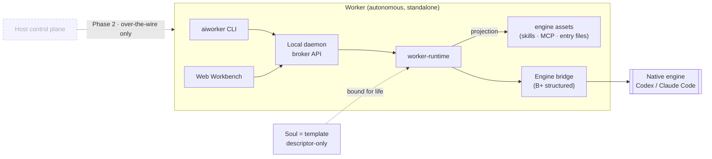

<div align="center">

# AIWorker

**Turn one expert's capability into a whole team's productivity — package it once as a Soul, and every employee gets an out-of-the-box, local-first AI Worker.**

[](https://www.npmjs.com/package/@zonease/aiworker-cli)
[](https://github.com/ZonEaseTech/aiworker/actions/workflows/lint.yml)
[](https://github.com/ZonEaseTech/aiworker/actions/workflows/release.yml)
[](./LICENSE)
[](https://github.com/ZonEaseTech/aiworker/blob/main/package.json)
[](https://github.com/ZonEaseTech/aiworker/commits)
[](https://bun.sh)
[](https://www.typescriptlang.org)

**English** · [简体中文](./README.zh-CN.md) · [日本語](./README.ja.md)

</div>

> [!NOTE]
> **Status: `1.0.0-rc` preview.** v1 ships the **standalone Worker** only. The Host control plane is **Phase 2** and is never on the runtime hot path. The architecture below is the canonical contract — see [`docs/architecture.md`](./docs/architecture.md).

AIWorker turns **one person's expertise into many employees' output**. A knowledgeable author packages a professional capability as a **Soul**, iterates it fast, and an organization copies it cheaply to employees who never touch the technical system — each gets an out-of-the-box, dedicated **AI Worker**.

| | | |
| --- | --- | --- |
| 🧩 | **Soul** = the capability | A descriptor-only bundle of engine assets (skills, native MCP, entry files). Author once, project to any engine. *The carrier.* |
| 🧍 | **Worker** = the employee's terminal | An autonomous, CLI-first runtime bound to one Soul for life, running it through a native engine (Codex / Claude Code) and serving its own web Workbench. *Fully standalone.* |
| 🎚️ | **Host** = the replication lever *(Phase 2)* | Publish, assign, roll out, and govern across employees. *Never on the runtime hot path.* |

> **One expert's capability → a whole team's capacity.**

- 🔒 **Local-first & secret-safe** — one local daemon, SQLite metadata, and a strict redaction boundary: secrets never land in descriptor, DB, logs, receipts, or UI.
- 🔌 **Engine-neutral, no lock-in** — descriptor-only Souls project to any supported native engine; the engine keeps model calls, tool loops, approval, sandbox, and auth.
- ⚡ **Zero-config** — `bunx @zonease/aiworker-cli start` bootstraps the DB, the bundled Freeform Soul, and the Worker, then opens the Workbench.

---

## Table of contents

- [What is AIWorker?](#what-is-aiworker)
- [Who is it for?](#who-is-it-for)
- [Capability replication (Phase 2)](#capability-replication-phase-2)
- [Mental model](#mental-model)
- [Architecture](#architecture)
- [Quickstart](#quickstart)
- [First run](#first-run)
- [Author a Soul](#author-a-soul)
- [Monorepo layout](#monorepo-layout)
- [Development](#development)
- [Testing & release gates](#testing--release-gates)
- [Roadmap](#roadmap)
- [Non-goals](#non-goals)
- [Documentation map](#documentation-map)
- [Contributing](#contributing)
- [License](#license)

## What is AIWorker?

Most AI tooling is either a developer IDE/agent or a cloud platform you rent. AIWorker is neither. It is the **runtime layer** that turns *one engine + one template* into a standalone, self-hosting **AI worker** you own and run locally — and, with the Phase 2 Host, the lever that copies that worker to a whole team.

The separation of concerns is strict and is the whole point:

| Layer | Owns | Does **not** own |
| --- | --- | --- |
| **Worker** | local daemon, Workbench web, workspaces, sessions, projection, engine launch, storage, redaction | model calls, tool loops, approval, sandbox |
| **Soul** (template) | engine assets: workspace files, skills, native MCP, entry files | UI, API, capabilities, domain backend |
| **Native engine** | model calls, tool loops, approval, sandbox, auth, native sessions | locating workspaces, persisting Worker state |
| **Host** *(Phase 2)* | distribution, management, permission allocation, connector authorization | session, invocation, projection, engine processes, secrets |

A Worker never depends on Host to run, and `worker-*` packages never import `host-*` packages — the autonomy boundary is enforced in code.

## Who is it for?

Organizations where **one expert's way of working should become everyone's** — and the people using it don't need to understand the technical system underneath.

| Role | Who | What they get |
| --- | --- | --- |
| **Capability author** | the in-house expert — senior HR, support lead, PM, ads specialist | packages a playbook as a Soul and iterates it fast, without turning it into an app or a backend |
| **Administrator** *(Phase 2)* | whoever allocates capability and access | copies one published Soul to many employees, with visible assignment, connector authorization, rollout, and rollback |
| **Employee** | the non-technical doer | an out-of-the-box, dedicated AI Worker — nothing to learn about Souls, descriptors, MCP, engines, or Host |

The author writes a Soul for any vertical; each employee's Worker runs it standalone. The example Souls under `souls/*` target a restaurant-POS SaaS team:

- **HR manager** — structured hiring workflows across backend / Flutter / PM / support roles
- **Software support** — ticket triage, POS troubleshooting, escalation issues through a quality gate
- **Product manager** — PRDs and issues that pass a five-dimension quality gate
- **Google Ads** — local restaurant campaign operations (Performance Max, Google Business Profile, store-visit conversions)

v1's strong-acceptance Soul is **`aiworker-freeform`**, which proves the full standalone loop end to end; the domain Souls above are descriptor-producing templates.

## Capability replication (Phase 2)

Phase 2 adds the organization side — distribution and governance, never the runtime hot path:

```text
author publishes a Soul version
  → administrator assigns it to an employee or group (connectors · permissions · profile)
    → the employee's Worker is provisioned and opens its own Workbench, ready to work
  ↺ author ships an update → administrator rolls it out, or rolls it back
```

Phase 2.1 adds managed remote access: an employee reaches their Worker through the Host enterprise URL, Logto auth, and a Worker-initiated tunnel. The Host is only the URL and authorization boundary — it never mounts, frames, renders, or proxies the Workbench, and a Host or tunnel outage never stops the local Worker.

## Mental model

Five nouns, one direction:

```text
Worker → Workbench → workspace → session (chat) → native engine
```

| Concept | What it is |
| --- | --- |
| **Worker** | An autonomous, CLI-first runtime, bound to exactly one Soul when created (fixed for its whole life). Starts its own local daemon, serves its Workbench, owns projection and the engine bridge, launches and observes the native engine, and exposes a local broker API. |
| **Soul** | The human-facing name for a **template** — a descriptor-only bundle of engine assets. It has no UI, no API, no capability layer. Installed via `dist/soul.descriptor.json`. |
| **Workbench** | The Worker's own web UI (in `apps/worker-web`, built from `packages/ui`). Manages workspaces, the sessions nested under each, the session chat, and the Worker's own configuration. |
| **Workspace** | A business scope under a Worker (e.g. a candidate, a release, an incident). Its root is derived under the Worker home — not an arbitrary repo path. |
| **Session** | A chat — a composer and a transcript — over one workspace. Lifecycle: `active │ archived │ deleted`. The first composer message becomes the session's first invocation. |
| **Engine invocation** | Execution/process state owned by the Worker, kept separate from session lifecycle. Follow-up is session-level: `POST /api/sessions/:sessionId/invocations`. |
| **Engine bridge** | A B+ structured native bridge: per-engine adapters (Codex, Claude Code), process management, redacted raw chunks, normalized events, opaque session refs, cancel, reattach, reconcile. |

## Architecture



**Daemon topology is one daemon per Worker.** A Worker daemon hosts at most one active Worker and carries zero fleet/Host awareness — a passive local server that serves its own CLI, Workbench web, and configuration. In Phase 2 the Host drives a transport-agnostic control contract over the wire and can direct an employee to the Worker-owned Workbench URL, but it does not mount, frame, embed, render, or proxy the Workbench; the Worker stays pure and behaves identically whether a Host is present or not.

## Quickstart

> **Prerequisites:** [Bun](https://bun.sh) `>=1.1` (recommended) or Node.js `>=20.19`. A native engine ([Codex](https://github.com/openai/codex) or [Claude Code](https://www.anthropic.com/claude-code)) on `PATH` for the `local-cli` path; without one, the BYOK fallback applies.

Run the packaged CLI — it bootstraps everything and opens the Workbench:

```bash
bunx @zonease/aiworker-cli start --port 9217
# or, using npm's runner:
npx @zonease/aiworker-cli start --port 9217
```

`aiworker start` ensures a single active Worker bound to the bundled Freeform Soul (installing the descriptor and creating the Worker when none exists, reusing it otherwise), starts the local daemon in the background, and opens the Workbench URL.

<details>
<summary><b>Other lifecycle commands</b></summary>

```bash
aiworker daemon start --port 9217        # same service, background, no browser
aiworker daemon foreground --port 9217   # same service, current process, no browser
aiworker daemon status                   # show daemon status
aiworker daemon logs --tail 100          # tail daemon logs
aiworker daemon restart --port 9217      # ensure Worker + restart service
aiworker daemon stop                     # stop the daemon
aiworker doctor                          # inspect local daemon readiness
```

All service-start commands are idempotent at the Worker readiness layer. The published path uses one service port; `5173` only belongs to the source-checkout Vite dev server.

</details>

## First run

After the Workbench opens, the standalone Worker already has a Freeform-bound active Worker — there is **no** create-Worker or Soul-catalog UI. The empty states *are* the first-run experience:

1. An empty Workbench prompts you to **create your first workspace** by name (its root is derived under the Worker home).
2. A workspace with no session prompts you to **start your first session**.
3. The session opens an empty chat; your **first message** becomes the first engine invocation. Follow-ups stay on the same session.

Settings open from an explicit button and cover Local CLI / BYOK, engine scan & test, connectors, MCP, language, appearance, and autosave.

`AIWORKER_HOME` defaults to `~/.aiworker` for the packaged CLI and `~/.aiworker-dev` for source checkouts; override either with `AIWORKER_HOME=<path>`.

## Author a Soul

A Soul is SDK-authored and CLI-first. The 30-second path:

```bash
aiworker soul create my-soul                 # scaffolds ./my-soul (and builds its descriptor)
cd my-soul
aiworker soul build                          # rebuild after edits → dist/soul.descriptor.json
aiworker app install dist/soul.descriptor.json
aiworker worker create --app my-soul         # bind a Worker to the Soul
```

A Soul is a template of **engine assets only** — no `web/`, no `api/`, no capabilities. The SDK discovers the common authoring layout by convention:

```text
my-soul/
  soul.config.ts            # identity + explicit overrides
  engine/
    workspace/              # projected workspace files
    skills/                 # projected skills
    mcp/
      codex/config.toml     # native MCP per engine target
      claude-code/.mcp.json
```

See [`docs/soul-authoring.md`](./docs/soul-authoring.md) for the full authoring contract, and [`packages/soul-sdk`](./packages/soul-sdk) for the SDK surface.

## Monorepo layout

```text
apps/
  worker-cli/    aiworker CLI + packaged local daemon entry
  worker-web/    the Worker-owned Workbench web (workspaces, sessions, chat)
  host-cli/      Phase 2 control-plane shell  (dormant stub)
  host-web/      Phase 2 control-plane shell  (dormant stub)

souls/
  aiworker-freeform/   v1 strong-acceptance descriptor Soul
  hr-manager/ software-support/ product-manager/ google-ads/   domain Soul templates (samples)

packages/
  worker-runtime/           Worker locator/runtime orchestration + engine adapters
  worker-daemon/            local broker API + Workbench web host
  soul-descriptor/          descriptor format + validation (soul/v1)
  soul-sdk/                 Soul authoring SDK + descriptor build
  engine-bridge/            B+ native engine bridge (adapters, process, events, redaction)
  engine-projection/        materialize engine-facing files from descriptor + overlays
  storage-sqlite/           worker.db schema, migrations, repositories
  fs-layout/                AIWORKER_HOME / worker / workspace path helpers
  ui/                       shadcn-managed shared UI primitives + theme
  host-control/             Phase 2 control plane            (dormant stub)
  worker-control-protocol/  Phase 2 Host↔Worker control contract (dormant stub)
```

> Boundaries are load-bearing: `apps/*` are runnable product shells, `souls/*` are descriptor-producing templates, and package names are plane-prefixed (`worker-*` is the autonomous runtime, `host-*` is the dormant Phase 2 control plane). `worker-*` packages must not import `host-*` packages.

## Development

```bash
bun install        # install workspace dependencies
bun run dev        # source-checkout dev: build web once, foreground the daemon
```

<details>
<summary><b>Common checks & focused builds</b></summary>

```bash
bun run typecheck   # all workspaces
bun run lint        # eslint + boundary + ui + docs checks
bun run test        # all workspace tests
bun run check       # typecheck + lint
bun run build       # worker-daemon + worker-web + CLI bundle

# focused
bun run --filter '@zonease/aiworker-worker-runtime' test
bun run --filter '@zonease/aiworker-worker-web' build
bun run --filter '@zonease/aiworker-cli' build:bundle
```

Source checkout without the `dev` script — build the web assets once, then foreground the daemon:

```bash
bun run --filter '@zonease/aiworker-worker-web' build
bun apps/worker-cli/src/aiworker.ts daemon foreground --port 9217
```

</details>

## Testing & release gates

Contract tests are the primary guardrail — focused static, unit, package, CLI, and browser proofs over large historical E2E. The aggregator is:

```bash
bun run release:check
```

which runs, in order: `docs:check` → `test:contracts` → `test:protocol` → `test:cli` → `test:browser:freeform` → `test:browser:phase2` → `typecheck` → `lint` → `build` → the release smokes (`dist-release`, `host-dist-release`, `standalone-release`, `standalone-runtime`, `npm-package`) → `test` → `check`. The v1 browser proof is Freeform-only and standalone. See [`docs/testing.md`](./docs/testing.md).

## Roadmap

| Phase | Scope |
| --- | --- |
| **v1 — now** | Standalone Worker · `aiworker-freeform` Soul · worker-owns-Workbench · native engine bridge (Codex / Claude Code) · zero-config `aiworker start` · BYOK fallback |
| **Phase 2 — Host control plane** | Optional distribution / management / permission allocation / connector authorization · Worker-initiated check-in and Worker Access tunnel · transport-agnostic control contract. Never on the runtime hot path. |
| **Phase 2.1 — managed access** | Employee remote access via Host enterprise URL + Logto + Worker-initiated tunnel; Host never renders the Workbench |
| **Later** | Further domain Souls as descriptor-producing templates |

## Non-goals

- No cloud backend or control server in v1 — the Host is Phase 2 and never on the runtime hot path.
- No micro-app, mounted workbench, iframe, or Host-rendered Worker UI, in any phase.
- A Soul provides no UI, app-owned API, capability layer, or domain backend.
- A Worker is bound to one Soul for life — no runtime Soul-switching.
- The Host is not a domain-workflow layer, product backend, agent runtime, repository dashboard, or Soul configuration center.

## Documentation map

The five canonical docs are the single source of truth; older notes are evidence only.

| Doc | Owns |
| --- | --- |
| [`AGENTS.md`](./AGENTS.md) | Agent bootstrap, product/monorepo/protocol/runtime boundaries |
| [`docs/architecture.md`](./docs/architecture.md) | Architecture contract, ownership, monorepo boundary, migration rules |
| [`docs/protocol.md`](./docs/protocol.md) | Descriptor v1, broker routes, Phase 2 control contract |
| [`docs/runtime.md`](./docs/runtime.md) | Session lifecycle, engine invocation, bridge, projection, secret boundary |
| [`docs/soul-authoring.md`](./docs/soul-authoring.md) | SDK authoring, convention discovery, build output, native MCP |
| [`docs/testing.md`](./docs/testing.md) | Coverage ledger, guardrails, release gates, browser proof scope |

## Contributing

Issues and PRs are welcome. Before opening a PR:

1. Read [`AGENTS.md`](./AGENTS.md) and the relevant canonical doc — the docs are authority; code follows them.
2. Keep changes scoped to the current phase and add focused contract tests for the touched surface.
3. Run `bun run check` (and `bun run release:check` for runtime-affecting changes) before pushing.
4. Default to Chinese for commits, comments, and PR descriptions unless you have a reason not to.

## License

[MIT](./LICENSE) © ZonEase Tech
