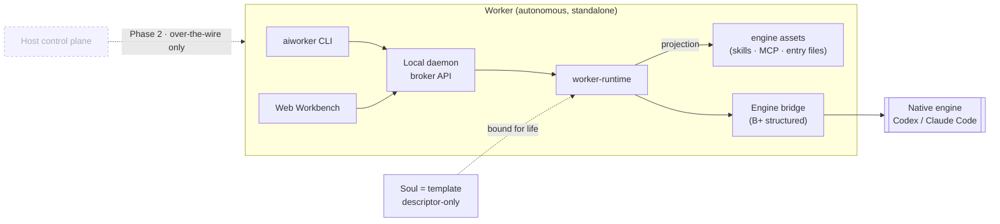

<div align="center">

# AIWorker

**运行一个自治的、本地优先的 AI worker —— 把一个 Soul 模板绑定到原生引擎,即可得到一个自托管、自带 Web Workbench 的运行体。**

[](https://www.npmjs.com/package/@zonease/aiworker-cli)
[](https://github.com/ZonEaseTech/aiworker/actions/workflows/lint.yml)
[](https://github.com/ZonEaseTech/aiworker/actions/workflows/release.yml)
[](./LICENSE)
[](https://github.com/ZonEaseTech/aiworker/blob/main/package.json)
[](https://github.com/ZonEaseTech/aiworker/commits)
[](https://bun.sh)
[](https://www.typescriptlang.org)

[English](./README.md) · **简体中文** · [日本語](./README.ja.md)

</div>

> [!NOTE]
> **状态:`0.x` 预览版。** v1 只发布**独立运行的 Worker**。Host 控制面属于 **Phase 2**,且永远不在运行热路径上。下文架构即权威合同 —— 见 [`docs/architecture.md`](./docs/architecture.md)。

AIWorker 是一个 **worker 为中心、本地优先的 AI 运行体**。一个 **Worker** 是自治的、CLI-first 的进程,它通过**原生引擎**(Codex / Claude Code)运行一个 **Soul**,拥有引擎启动权,并提供自己的 Web **Workbench**。无需云端后端,无需控制服务器 —— 一条命令即可在你的机器上拉起一个自托管的 AI worker。

- 🧍 **Worker 为中心** —— 每个 Worker 都是自治的 CLI-first 运行体,创建时绑定一个 Soul 并*终生不变*。它拥有引擎启动权,可在 Host 缺席时完全独立运行。
- 🧩 **Soul = 模板** —— 一个 descriptor-only 的引擎资产束(workspace 文件、skills、原生 MCP 文件、`AGENTS.md` / `CLAUDE.md` 等 entry 文件)。没有 UI、没有 app 私有 API、没有锁定。一次编写,投影到任意受支持的引擎。
- 🖥️ **拥有自己的 Workbench** —— Worker 直接渲染自己的 Web UI(workspace、session、chat)。没有 mounted micro-app,没有 Soul 提供的 UI。
- 🔌 **原生引擎桥接** —— 通过结构化 bridge 驱动引擎(进程管理、脱敏、取消、重连、对账)。模型调用、tool loop、审批、沙箱、鉴权都仍归引擎所有。
- 🔒 **本地优先且密钥安全** —— 单个本地 daemon、SQLite 元数据,以及严格的脱敏边界:密钥绝不进入 descriptor、DB、日志、receipt 或 UI。
- ⚡ **零配置启动** —— `bunx @zonease/aiworker-cli start` 完成 DB、内置 Freeform Soul 和 Worker 的 bootstrap,并打开 Workbench。

---

## 目录

- [什么是 AIWorker?](#什么是-aiworker)
- [它为谁而建?](#它为谁而建)
- [心智模型](#心智模型)
- [架构](#架构)
- [快速开始](#快速开始)
- [首次运行](#首次运行)
- [编写一个 Soul](#编写一个-soul)
- [Monorepo 结构](#monorepo-结构)
- [开发](#开发)
- [测试与发布门禁](#测试与发布门禁)
- [路线图](#路线图)
- [文档地图](#文档地图)
- [贡献](#贡献)
- [许可证](#许可证)

## 什么是 AIWorker?

大多数 AI 工具要么是开发者 IDE/agent,要么是租用的云平台。AIWorker 两者都不是。它是**运行时层**:把*一个引擎 + 一个模板*变成一个你自己拥有、本地运行的、独立自托管的 **AI worker**。

职责分离是严格的,这正是它的全部意义所在:

| 层级 | 拥有 | **不**拥有 |
| --- | --- | --- |
| **Worker** | 本地 daemon、Workbench web、workspace、session、projection、引擎启动、存储、脱敏 | 模型调用、tool loop、审批、沙箱 |
| **Soul**(模板) | 引擎资产:workspace 文件、skills、原生 MCP、entry 文件 | UI、API、capability、领域后端 |
| **原生引擎** | 模型调用、tool loop、审批、沙箱、鉴权、native session | 定位 workspace、持久化 Worker 状态 |
| **Host**(*Phase 2*) | 分发、管理、权限分配、connector 授权 | session、invocation、projection、引擎进程、密钥 |

Worker 运行时绝不依赖 Host,且 `worker-*` 包绝不 import `host-*` 包 —— 这条自治边界在代码层强制执行。

## 它为谁而建?

AIWorker 为这样的组织而建:想把**一个专家的能力复制给一整支团队** —— 一个懂行的作者把专业能力打包成 Soul,每个员工因此获得一个开箱即用的专属 AI Worker。它是一个面向垂直与组织化工作流的**本地、自包含 AI worker**,而**不是**又一个开发者 IDE 或租用的 agent 平台。

作者为任意垂直职能编写一个 Soul,每个员工的 Worker 即可独立运行它:

- **PM** —— PRD、决策记录、roadmap 切片、状态报告
- **质量** —— 测试计划、回归矩阵、缺陷证据、release gate
- **People ops** —— 候选人初筛、面试 brief、岗位 rubric、招聘风险
- **DevOps** —— 部署清单、事故复盘、runbook 更新、容量摘要
- **财务 / 法务 / 运营** —— 各自领域的审查、模板化输出、证据链

组织侧的复制杠杆 —— 发布、分配、灰度、回滚 —— 是 Phase 2 的 Host;v1 先发独立运行的 Worker 作为底座。v1 的唯一验收 Soul **`aiworker-freeform`** 证明完整的独立运行闭环。HR 与 QA Soul 随后以 descriptor-producing 模板的形式补齐。

## 心智模型

五个名词,一个方向:

```text
Worker → Workbench → workspace → session (chat) → native engine
```

| 概念 | 含义 |
| --- | --- |
| **Worker** | 自治的、CLI-first 运行体,创建时绑定恰好一个 Soul(终生固定)。它启动自己的本地 daemon,提供自己的 Workbench,拥有 projection 与 engine bridge,启动并观测原生引擎,并暴露本地 broker API。 |
| **Soul** | **模板**的人类可读名称 —— 一个 descriptor-only 的引擎资产束。它没有 UI、没有 API、没有 capability 层。通过 `dist/soul.descriptor.json` 安装。 |
| **Workbench** | Worker 自己的 Web UI(位于 `apps/worker-web`,由 `packages/ui` 构建)。管理 workspace、嵌套于其下的 session、session chat,以及 Worker 自身配置。 |
| **Workspace** | Worker 下的业务作用域(如一个候选人、一个 release、一次 incident)。其根目录派生于 Worker home —— 不是任意 repo 路径。 |
| **Session** | 针对一个 workspace 的 chat —— 一个 composer 加一段 transcript。生命周期:`active │ archived │ deleted`。第一条 composer 消息成为 session 的首次 invocation。 |
| **Engine invocation** | Worker 拥有的执行/进程状态,与 session 生命周期分离。Follow-up 是 session 级:`POST /api/sessions/:sessionId/invocations`。 |
| **Engine bridge** | B+ 结构化原生 bridge:逐引擎 adapter(Codex、Claude Code)、进程管理、脱敏的 raw chunk、归一化事件、不透明 session ref、取消、重连、对账。 |

## 架构



**daemon 拓扑是每个 Worker 一个 daemon。** 一个 Worker daemon 最多承载一个 active Worker,且零 fleet/Host 感知 —— 它是一个被动的本地服务,只服务自己的 CLI、Workbench web 和配置。Phase 2 中,Host 通过 over-the-wire 的传输无关控制合同驱动,并可把员工引导到 Worker 自有的 Workbench URL,但绝不 mount / frame / embed / render / proxy 这个 Workbench;无论 Host 是否存在,Worker 保持纯净、行为一致。

## 快速开始

> **前置条件:** [Bun](https://bun.sh) `>=1.1`(推荐)或 Node.js `>=20.19`。`local-cli` 路径需要 `PATH` 上有一个原生引擎([Codex](https://github.com/openai/codex) 或 [Claude Code](https://www.anthropic.com/claude-code));若没有,则走 BYOK 回退。

运行打包好的 CLI —— 它会 bootstrap 一切并打开 Workbench:

```bash
bunx @zonease/aiworker-cli start --port 9217
# 或使用 npm 的 runner:
npx @zonease/aiworker-cli start --port 9217
```

`aiworker start` 确保存在一个绑定内置 Freeform Soul 的 active Worker(不存在时安装 descriptor 并创建 Worker,存在则复用),在后台启动本地 daemon,并打开 Workbench URL。

<details>
<summary><b>其他生命周期命令</b></summary>

```bash
aiworker daemon start --port 9217        # 同一服务,后台,不开浏览器
aiworker daemon foreground --port 9217   # 同一服务,前台进程,不开浏览器
aiworker daemon status                   # 查看 daemon 状态
aiworker daemon logs --tail 100          # 查看 daemon 日志
aiworker daemon restart --port 9217      # 确保 Worker + 重启服务
aiworker daemon stop                     # 停止 daemon
aiworker doctor                          # 检查本地 daemon 就绪状态
```

所有 service-start 命令在 Worker 就绪层都是幂等的。发布路径只有一个 service 端口;`5173` 仅属于 source-checkout 的 Vite dev server。

</details>

## 首次运行

Workbench 打开后,独立 Worker 已有一个绑定 Freeform 的 active Worker —— **没有**创建 Worker 或 Soul 目录的 UI。空状态*就是*首次运行体验:

1. 空的 Workbench 提示你按名称**创建第一个 workspace**(其根目录派生于 Worker home)。
2. 没有 session 的 workspace 提示你**开始第一个 session**。
3. session 打开一个空 chat;你的**第一条消息**成为首次引擎 invocation。Follow-up 留在同一个 session 上。

Settings 由一个明确的按钮打开,涵盖 Local CLI / BYOK、引擎扫描与测试、connectors、MCP、语言、外观与 autosave。

`AIWORKER_HOME` 在打包 CLI 下默认 `~/.aiworker`,在 source checkout 下默认 `~/.aiworker-dev`;两者都可用 `AIWORKER_HOME=<path>` 覆盖。

## 编写一个 Soul

Soul 由 SDK 编写、CLI-first。30 秒路径:

```bash
aiworker soul create my-soul                 # 在 ./my-soul 生成脚手架(并构建 descriptor)
cd my-soul
aiworker soul build                          # 修改后重新构建 → dist/soul.descriptor.json
aiworker app install dist/soul.descriptor.json
aiworker worker create --app my-soul         # 把 Worker 绑定到 Soul
```

Soul 是一个**只含引擎资产**的模板 —— 没有 `web/`、没有 `api/`、没有 capability。SDK 按约定发现常用编写布局:

```text
my-soul/
  soul.config.ts            # identity + 显式覆盖
  engine/
    workspace/              # 投影的 workspace 文件
    skills/                 # 投影的 skills
    mcp/
      codex/config.toml     # 逐引擎目标的原生 MCP
      claude-code/.mcp.json
```

完整编写合同见 [`docs/soul-authoring.md`](./docs/soul-authoring.md),SDK 接口见 [`packages/soul-sdk`](./packages/soul-sdk)。

## Monorepo 结构

```text
apps/
  worker-cli/    aiworker CLI + 打包的本地 daemon 入口
  worker-web/    Worker 拥有的 Workbench web(workspace、session、chat)
  host-cli/      Phase 2 控制面壳   (休眠桩)
  host-web/      Phase 2 控制面壳   (休眠桩)

souls/
  aiworker-freeform/   v1 强验收 descriptor Soul

packages/
  worker-runtime/           Worker locator/runtime 编排 + 引擎 adapter
  worker-daemon/            本地 broker API + Workbench web 宿主
  soul-descriptor/          descriptor 格式 + 校验 (soul/v1)
  soul-sdk/                 Soul 编写 SDK + descriptor 构建
  engine-bridge/            B+ 原生引擎 bridge(adapter、进程、事件、脱敏)
  engine-projection/        从 descriptor + overlay 物化引擎可见文件
  storage-sqlite/           worker.db schema、migrations、repositories
  fs-layout/                AIWORKER_HOME / worker / workspace 路径助手
  ui/                       shadcn 管理的共享 UI 原语 + 主题
  host-control/             Phase 2 控制面             (休眠桩)
  worker-control-protocol/  Phase 2 Host↔Worker 控制合同 (休眠桩)
```

> 边界是承重的:`apps/*` 是可运行的产品壳,`souls/*` 是 descriptor-producing 模板,包名带 plane 前缀(`worker-*` 是自治运行时,`host-*` 是休眠的 Phase 2 控制面)。`worker-*` 包绝不可 import `host-*` 包。

## 开发

```bash
bun install        # 安装 workspace 依赖
bun run dev        # source-checkout 开发:构建一次 web,前台运行 daemon
```

<details>
<summary><b>常用检查与聚焦构建</b></summary>

```bash
bun run typecheck   # 全部 workspace
bun run lint        # eslint + 边界 + ui + docs 检查
bun run test        # 全部 workspace 测试
bun run check       # typecheck + lint
bun run build       # worker-daemon + worker-web + CLI 打包

# 聚焦
bun run --filter '@zonease/aiworker-worker-runtime' test
bun run --filter '@zonease/aiworker-worker-web' build
bun run --filter '@zonease/aiworker-cli' build:bundle
```

不使用 `dev` 脚本的 source checkout —— 先构建一次 web 资源,再前台运行 daemon:

```bash
bun run --filter '@zonease/aiworker-worker-web' build
bun apps/worker-cli/src/aiworker.ts daemon foreground --port 9217
```

</details>

## 测试与发布门禁

契约测试是首要护栏 —— 用聚焦的静态、单元、包、CLI 和浏览器证明,而非庞大的历史 E2E。聚合器是:

```bash
bun run release:check
```

它依次运行:`docs:check` → `test:contracts` → `test:protocol` → `test:cli` → `test:browser:freeform` → `typecheck` → `lint` → `build` → 发布 smoke(`dist-release`、`standalone-release`、`standalone-runtime`、`npm-package`)→ `test` → `check`。v1 浏览器证明只针对 Freeform 且为独立运行。见 [`docs/testing.md`](./docs/testing.md)。

## 路线图

| 阶段 | 范围 |
| --- | --- |
| **v1 —— 当前** | 独立 Worker · `aiworker-freeform` Soul · worker 拥有 Workbench · 原生引擎 bridge(Codex / Claude Code)· 零配置 `aiworker start` · BYOK 回退 |
| **Phase 2 —— Host 控制面** | 可选的 分发 / 管理 / 权限分配 / connector 授权 · Worker 发起的 check-in 与 Worker Access tunnel · 传输无关的控制合同。永远不在运行热路径上。 |
| **更远** | HR、QA 及更多垂直 Soul 以 descriptor-producing 模板形式重写 |

## 文档地图

五份 canonical 文档是唯一权威来源;旧笔记仅作证据。

| 文档 | 拥有 |
| --- | --- |
| [`AGENTS.md`](./AGENTS.md) | Agent bootstrap,产品/monorepo/protocol/runtime 边界 |
| [`docs/architecture.md`](./docs/architecture.md) | 架构合同、ownership、monorepo 边界、迁移规则 |
| [`docs/protocol.md`](./docs/protocol.md) | Descriptor v1、broker routes、Phase 2 控制合同 |
| [`docs/runtime.md`](./docs/runtime.md) | session 生命周期、engine invocation、bridge、projection、密钥边界 |
| [`docs/soul-authoring.md`](./docs/soul-authoring.md) | SDK 编写、约定发现、构建输出、原生 MCP |
| [`docs/testing.md`](./docs/testing.md) | 覆盖率台账、护栏、发布门禁、浏览器证明范围 |

## 贡献

欢迎 issue 与 PR。提交 PR 前:

1. 阅读 [`AGENTS.md`](./AGENTS.md) 及相关 canonical 文档 —— 文档是权威,代码跟随文档。
2. 让改动聚焦于当前阶段,并为触及的面补充聚焦的契约测试。
3. 推送前运行 `bun run check`(影响运行时的改动再跑 `bun run release:check`)。
4. commit、注释、PR 描述默认用中文,除非有理由不这样做。

## 许可证

[MIT](./LICENSE) © ZonEase Tech
