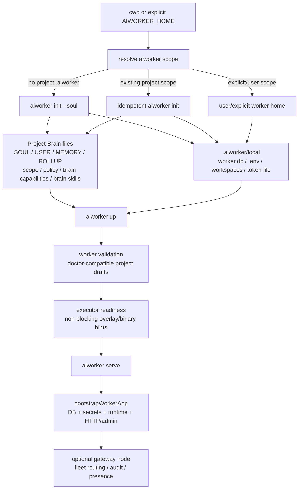
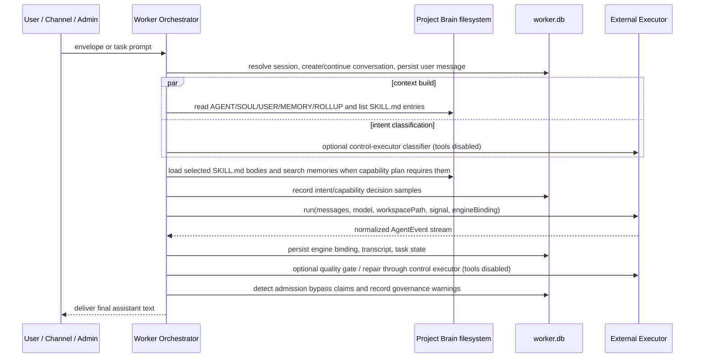
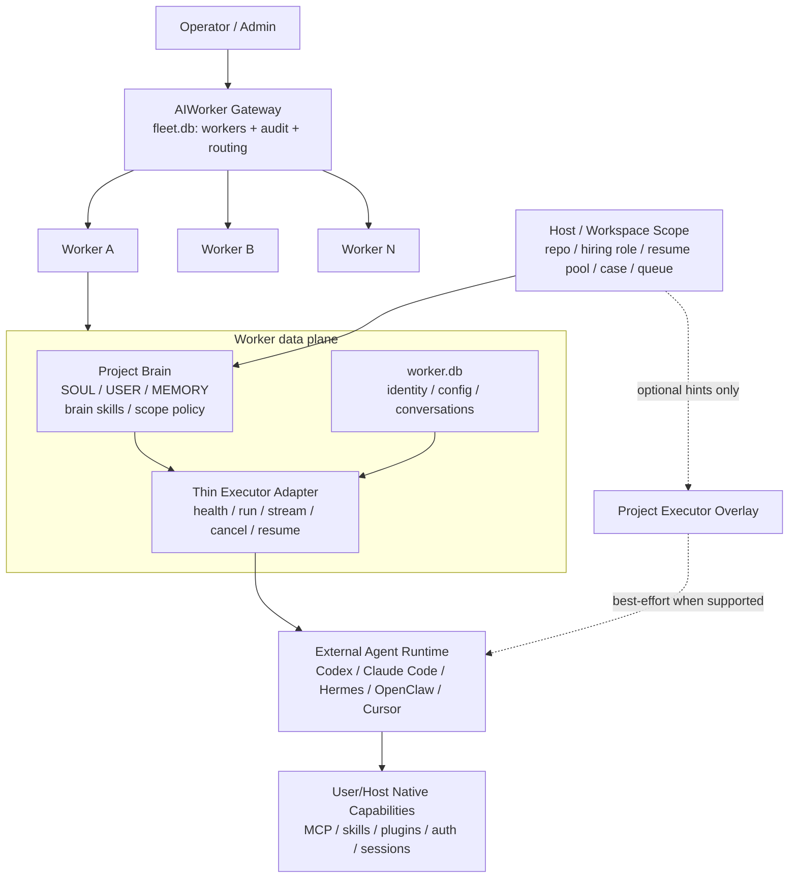
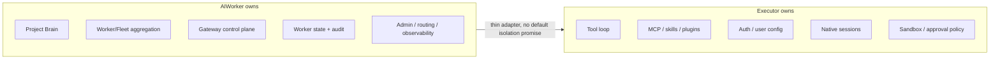

# AIWorker Architecture

## Monorepo Layout

```text
apps/
  api/          # Hono worker runtime (worker mode only)
  cli/          # aiworker (单二进制：worker / fleet / gateway 命令树)
  web/          # React 19 双视角 SPA（fleet 走 gateway WS；worker 自管走 REST/SSE）
packages/
  shared/          # cross-layer types / constants / zod schemas
  gateway/         # WS 控制面：operator ↔ gateway ↔ node 三方协议枢纽
  gateway-proto/   # WS 协议纯类型 + zod：METHODS / EVENTS / Frame
  core/            # transport-agnostic worker runtime（@zonease/aiworker-core）
  storage-sqlite/  # fleet.db + worker.db schemas, drizzle configs, migrations
  fs-layout/       # user/project scope path resolver + worker/project layout bootstrap
```

- **`apps/api`** 只负责 worker 运行时（数据面）。`AIWORKER_MODE=worker` 仍保留以兼容运维脚本，但入口不再按模式分叉——`boot()` 一律构建 `createWorkerApp`。dashboard REST 已随 PLAN-013 整体下线。运行时业务（brain / executor / channels / orchestrator / cron / approvals / gateway-client / runtime / secrets / bootstrap / management 业务态）已物理抽离至 `packages/core`，apps/api 仅保留 Hono 路由 + middleware + bootstrap 装配（`@zonease/aiworker-api/bootstrap` 暴露给 `aiworker serve`），保持 transport 与业务的边界。
- **`packages/gateway`** 是 WS 控制面，单入口 `Bun.serve(:9218)`，路径 `/ws` 承接 WebSocket 升级，`/health` 返回心跳。运行时持有 fleet.db（`registered_workers` + `audit_events`）并做 operator ↔ node 帧转发。见 `docs/gateway.md`。
- **`apps/cli`** 发布单枚 bin：`aiworker`。裸 `aiworker <cmd>` 等价于本地 worker 快捷入口；`aiworker worker ...` 是本地 worker canonical tree，`aiworker fleet ...` 通过 gateway WS 操作 fleet 与远端 worker，`aiworker gateway ...` 管理 gateway 生命周期和 systemd install。`aiworker up` / `aiworker worker up` 是本地 worker 快速启动编排（init → validation → executor readiness → serve），共享 `cac` 解析器与 `@zonease/aiworker-core` 运行时复用（worker-local `aiworker serve` 额外从 `@zonease/aiworker-api/bootstrap` 取 Hono 入口）。状态文件按用法分流：worker-local 写 `worker.db`，fleet/gateway operator state 写 `~/.aiworker/aiworker.json`。
- **`apps/web`** 产出两套物理独立 bundle：`dist/fleet/` 由 gateway 托管，fleet 视角只通过 gateway WS (`/ws`) 访问 fleet.db / worker 指针；`dist/worker/` 由每个 worker 自身托管，worker 视角只通过本机 `/api/worker/*` REST/SSE + bearer-auth 管理 worker.db / runtime。源码按 `src/fleet/`、`src/worker/`、`src/shared/` 分区，ESLint 与 CI 守住跨视角 import / transport 边界。
- **`packages/gateway-proto`** 是协议的纯类型 + 运行时校验层。不依赖任何网络框架，所有 METHODS / EVENTS / Frame schema 都在这里定义，CLI / web / gateway / worker 四侧共用。
- **`packages/core`** 是 transport-agnostic 的 worker runtime（PLAN-015 §S1 物理抽离）。封装 brain provider、executor provider、channel adapter、orchestrator、cron、approvals、gateway-client、secrets、bootstrap、management 业务态等所有运行时业务；公共面 `packages/core/src/index.ts` 同时被 `apps/api` 路由、`apps/cli` 与 gateway node 接入复用。**不**依赖 `hono` / `@hono/*` / `@scalar/*`——边界由 ESLint `no-restricted-imports` 守，CI 拦下任何回退到 transport 层耦合的尝试。
- **`packages/storage-sqlite`** 是 fleet.db 与 worker.db 的唯一 schema 源。通过 subpath `./fleet` 与 `./worker` 保持数据域边界；`defaultFleetMigrationsFolder` / `defaultWorkerMigrationsFolder` 通过 `import.meta.url` 解析，避免调用方硬编码 `./drizzle/...`。
- **`packages/fs-layout`** 管理 user scope 的 `~/.aiworker/workers/<id>/` 与 project scope 的 `<project>/.aiworker/` 目录布局。gateway 与 worker 都复用它解析 `SOUL.md` / `USER.md` / `MEMORY.md` / `config.yaml` / `brain/` 等路径。

## Product Positioning

AIWorker 是轻量自托管 **Project Brain + Worker/Fleet aggregation runtime**。
它的核心资产是 scope-bound Project Brain 与 worker/fleet 控制面，而不是另一个
完整 executor 平台。

这里的 Project 是 worker 在 host/workspace 维度绑定的业务作用域，不等同于
software project 或代码仓库。developer Soul 可以把 scope 绑定到 repo；HR Soul
可以把 scope 绑定到岗位、候选人池、简历库、筛选/归档/审核流程；legal、
finance、ops 等 Soul 也应围绕各自业务对象和证据链建模。Project Brain 的通用
内核应服务 scope identity、artifacts、policies、workflow state、audit、
retention、backup 和 context compilation，而不是内建 PMA/代码项目假设。

- **AIWorker owns**：Project Brain、worker identity/state、worker.db、
  gateway routing、fleet presence、audit、admin UI、conversation persistence
  和外部 executor 的薄 adapter。
- **External executors own**：tool loop、MCP / skills / plugins、sandbox、
  approval、native session、subagent、model/provider/auth 与 user/host-level
  config。AIWorker 不默认隔离或重实现这些生态。
- **Project executor overlay**：`.aiworker/executor-capabilities.json` 只表达
  project 希望外部 executor 具备的 overlay / bootstrap hint；它不是 effective
  executor capability source of truth，也不是安全隔离边界。

### Worker product lifecycle: init → up → serve

Worker 的产品形态不是“先选 executor 再跑任务”，而是 **先建立 Project Brain，再
把外部 executor 接进这个 scope**。本地 operator 从一个 host/workspace 目录进入：



`aiworker init` 的职责：

- 在 project scope 下创建 `<project>/.aiworker/` 这颗 git-reviewable Project
  Brain：`SOUL.md`、`USER.md`、`MEMORY.md`、`ROLLUP.md`、`scope.json`、
  `policy.json`、`brain-capabilities.json`、
  `.aiworker/skills/<id>/SKILL.md`、`.aiworker/memories/`
  和 `.aiworker/executor-capabilities.json`。
- 在 `.aiworker/local/` 创建本机私有 worker state：`worker.db`、`.env`、
  `workspaces/`、bootstrap token file。这里是 runtime state，不是团队共享
  Brain。
- 从选定 Soul Pack 一次性 materialize persona 与默认 brain skill；已存在文件
  no-overwrite，后续编辑以文件为权威。

`aiworker up` 是本地 worker 的组合启动命令，语义固定为五段：resolve scope →
init if needed → worker validation → executor readiness → serve。它不把 executor
readiness 作为硬阻塞安全边界：engine 登录态、user-level MCP、engine-native skill /
plugin / session 仍归 executor 自己管理；AIWorker 只给 operator 一个非阻塞诊断。

`aiworker serve` 是数据面进程：初始化/迁移 `worker.db`，加载或创建 worker
identity/config，注回 secret refs，构建 `WorkerRuntime`，挂载 worker REST/SSE、
Worker Admin 静态资源与可选 gateway node。hot reload 只通过 `reloadRuntime`
串行替换 runtime；旧 runtime 必须 dispose 长连接/observer，但 ProcessManager 这类
跨 reload 的进程管控状态保持。

因此，从产品角度看，`init` 交付的是“可编辑、可审计的 Project Brain + 本地 worker
身份”；`up/serve` 交付的是“把这个 Brain 挂到一个外部 executor 上，并通过
worker/fleet 控制面观察和治理它”。

### Brain / Executor runtime loop

Brain runtime 的正确心智模型是 **context + governance wrapper**，不是另一个
executor。它把 Project Brain 投影给外部 executor，并围绕 executor 输出做
quality/admission/audit，而不接管 executor 的 tool loop。



运行时分工：

- **Project Brain filesystem**：`SOUL.md` / `USER.md` /
  `MEMORY.md` / `ROLLUP.md` / `skills/<id>/SKILL.md` 是 canonical context
  surface。`FilesystemBrainProvider` 负责扫描、检索和 watch；SQLite 不替代这些
  Markdown 文件成为 Brain source of truth。
- **ContextManager**：把 persona、user profile、memory index、continuity rollup
  和 brain skill 摘要拼进 system prompt；当 intent / capability plan 要求
  `skill_load` 时，按选中 skill id 读取 `SKILL.md` body、剥离 frontmatter，并把
  bounded body 追加为本轮 Project Brain context；当要求 `memory_search` 时，用
  inbound turn text 查询 `BrainProvider.searchMemories()`，把 bounded memory
  snippets 追加为本轮 Project Brain context。
- **Capability registry**：记录本轮可见 brain skill / Brain MCP descriptor / toolset
  选择。`load_skill` 与 `memory_search` 已由 orchestrator 实现为内部 context
  loader，并在 capability decision 中报告 loaded ids/count/errors；`brain-capabilities.json`
  descriptor 仍是 observe-only context signal，不等于 executor-native tools。
- **Executor adapter**：`ExecutorProvider.run(input)` 是唯一 task 执行入口。
  Orchestrator 只传 messages、model hint、workspacePath、abort signal 与可选
  engine native binding；外部 executor 自己决定 tool loop、MCP、engine skill、
  plugin、approval、sandbox、auth、native session。
- **Quality gate**：默认 observe；只有配置为 `warn` / `retry` / `block` 时才改变
  assistant 输出。LLM evaluator 与 repair 也通过 control executor，显式禁用工具。
- **Brain admission**：generated durable Brain mutation 必须进入
  `brain_admission_proposals`，再由 operator approve/apply。当前自动 materializer
  支持 `memory-add` 与 `brain-skill-add`；`policy-update` 仍是 proposal + 人工
  后续，不是 runtime 自动改写。

这个循环保留了 OD-style file-first 可编辑性，但没有盲目复制“skill loader 就是
runtime 能力”的假设：AIWorker 的 brain skill 是 Project Brain 资产与 prompt/context
素材；executor-native skill/plugin/MCP 仍属于 executor。

### Implementation conformance audit (2026-05-07)

本表是对当前源码的反查结论。新增开发如果改变其中任一行，必须同步本节与
`docs/governance-node-status.md`，避免架构文档继续描述旧现实。

| Claim | Current code evidence | Status |
|------|-----------------------|--------|
| `init` 先建立 Project Brain，再建立本地 worker state。 | `apps/cli/src/commands/worker/init.ts` 通过 `buildProjectAiworkerSeed()` 生成 Soul、scope、policy、`brain-capabilities.json` 和 brain skill seed；`packages/fs-layout/src/index.ts::ensureProjectAiworker()` no-overwrite 写 `.aiworker/` 与 `local/`。 | conforming |
| Project scope 下 shared Brain 与 local runtime state 分离。 | `resolveAiworkerScope()` 把 active home 指到 `.aiworker/local/`，`resolveBrainHome()` / `resolveWorkerHome()` 在 project scope 返回 `.aiworker/` 作为 Brain root。 | conforming |
| `up` 是 init/validate/readiness/serve 的组合命令。 | `apps/cli/src/commands/worker/up.ts::runUp()` 明确打印并执行 5 stages；executor readiness 失败只给 WARN/Next，不阻塞 serve。 | conforming |
| `serve` 是 worker HTTP/admin/runtime 生命周期入口。 | `apps/cli/src/commands/worker/serve.ts::runServe()` 调 `bootstrapWorkerApp()`，挂 `Bun.serve`、Worker Admin、pidfile、optional gateway node 和 shutdown；`apps/api/src/modes/worker.ts` 执行 DB/config/secrets/runtime bootstrap。 | conforming |
| Brain provider 以 filesystem 为权威。 | `packages/core/src/worker/brain/factory.ts` 默认经 `resolveBrainHome(workerId)` 构造 `FilesystemBrainProvider`；scanner 只识别 `skills/**/SKILL.md` 和 `memories/**/*.md`。 | conforming |
| Soul/Brain skill authoring 已转为 file-first pack。 | `packages/shared/src/soul/packs/*` 和 `packages/shared/src/brain/skills/*` 是 Markdown source；`brainSkillPackSeedFiles()` 在 init 时 materialize 到 project `.aiworker/skills/`。 | conforming in current source |
| Runtime 会把 Project Brain 投影给 executor。 | `ContextManager.buildSystemPrompt()` 读取 `SOUL.md` / `USER.md` / `MEMORY.md` / `ROLLUP.md`，列出可用 brain skill 摘要；当 `skill_load` 被选中时，`ContextManager.loadSkillBodies()` 读取 selected `SKILL.md` body；当 `memory_search` 被选中时，`ContextManager.searchMemories()` 查询 provider 并注入 matched snippets。 | conforming for soul + skill + memory context |
| Capability decision 是可执行能力选择。 | `CapabilityRegistry.snapshot()` 产出 `load_skill` / `memory_search` / Brain MCP descriptor / skill summaries；service 对 `load_skill` / `memory_search` 调用对应 context loader，并在 event 中报告 loaded ids/count/errors。`brain-capabilities.json` 中的 MCP descriptor 仍未执行为 executor tools。 | partial: brain context loaders enforced, mcp descriptor observe-only |
| Executor 是 thin adapter，不是 AIWorker 内建 agent runtime。 | `packages/shared/src/providers/executor.ts` 的 contract 和 `packages/core/src/worker/executor/factory.ts` 的 switch 只构造 adapter；`Orchestrator.buildAgentRunInput()` 只传 messages/model/workspace/signal/binding。 | conforming |
| Quality gate 是治理层，不是默认 hard rewrite。 | `quality-gate.ts` 用 `resolveQualityGateMode()` 如实标 observe/enforced；`service.ts` 只有在 config mode 为 `retry` / `block` / `warn` 时才修改输出。 | conforming |
| Durable Brain mutation 走 admission。 | `BrainAdmissionService` 持有 proposal/decision 状态机，CLI/API/gateway handlers 都转进该 service；pre-compaction memory flush 只 `propose(memory-add)`。 | conforming for memory-add and brain-skill-add |
| Brain 自我迭代已经能自动落 skill/policy。 | `MATERIALIZED_PROPOSAL_KINDS = ['memory-add', 'brain-skill-add']`；`brain-skill-add` commit 写 `skills/<id>/SKILL.md`，校验 frontmatter/id/no-overwrite/secret scan；`policy-update` 仍 unsupported。 | partial: skill yes, policy no |
| Gateway/fleet 不复制 worker Brain。 | architecture 与 `WorkerInfo` summary surface 只暴露计数/summary；admission/artifact 全文通过 worker data plane REST/WS bridge 读取。 | conforming by design; keep testing through harness |

> Conformance snapshot — see `docs/governance-node-status.md` for the
> evidence-backed summary of where the worker meets the Project Brain
> governance node target and where residual boundary / risk remains.

### Brain Governance Kernel 决策

AIWorker 的 Brain 层定位为 **Governance Brain Kernel**：治理型上下文内核，而不是
硬编码领域自动化引擎。这个决策覆盖 FEAT-054 / PLAN-097..103 已落地的 Soul
module、scope manifest、artifact registry、schema pack、admission MVP、brief
compiler 与 Worker/Fleet Brain surface，并作为后续 Brain 开发的默认边界。

一句话规则：**hard logic owns invariants, LLM owns semantics**。

- **硬逻辑只守不变量**：scope identity、数据面隔离、provenance/evidence、
  admission 状态机、secret/sensitivity redaction、权限收口、token budget、
  source tagging、rollback/audit、fleet 不复制 worker brain 等治理问题，必须由
  AIWorker hard logic 明确守住。
- **语义判断交给 LLM / executor**：候选人是否匹配岗位、合同条款是否重要、财务异常
  是否值得升级、代码变更是否合理、下一步该查哪个证据、某条 memory 是否该被引用等
  领域判断，不进入 Brain Kernel 的 hardcoded workflow。Brain 负责把证据、安全边界和
  scope context 投影给 executor，不能把自己做成 HR/finance/legal/dev 的业务规则引擎。
- **AIWorker 不承诺替代 executor**：tool loop、engine-native memory、MCP、plugins、
  sandbox、approval、native session 与 subagent 仍归外部 executor。Brain Kernel 可以
  观察、标注、警告和生成 admission proposal，但不接管 executor 的 effective capability
  或 user/host-level auth。

这个边界不是“Brain 变弱”，而是避免把 Project Brain 做重到不可维护：Brain Kernel
保留可审计、可迁移、可治理的长期资产；LLM 保留语义弹性；operator 保留最终批准权。
如果新增逻辑无法回答“它守的是哪个治理不变量”，它默认不应该进入 Brain hard logic。

现有组件按下面方式解释，后续实现不得把它们升级成隐藏的领域引擎：

| 组件 | 正确定位 | 允许的 hard logic | 明确禁止 |
|------|----------|-------------------|----------|
| **Soul Pack** | LLM-readable file package：`SOUL.md` + YAML frontmatter，承载 persona、语气、风险偏好、领域词汇、默认 brief sections。`SoulModule` 只是 loader 输出。 | frontmatter schema validation、pack discovery、版本/owner 元数据、风险提示模板。 | 把 Soul 写成 HR/finance/legal/dev 的 deterministic planner；把 Soul 语义继续维护在 TS/JSON registry；或让 preset 自动执行领域 workflow。 |
| **Scope manifest** | worker-bound business scope 的身份与证据目录，不限定为 git repo。 | scope id/path 解析、owner/status、source refs、manifest schema、跨 worker/fleet 边界。 | 假定所有 Project 都是软件项目，或在 manifest 里内建 PMA/代码仓库专用状态机。 |
| **Artifact registry** | evidence index：记录 ref、hash、来源、敏感级别、摘要与读取状态。 | 去重、redaction、missing/unreadable 标记、source tagging、worker.db 数据面隔离。 | 当成 ATS/CRM/ticket/contract/finance database；用 hard logic 解释 artifact 的业务含义并自动推进流程。 |
| **Schema pack** | Soul-specific vocabulary / lightweight validation hints。 | 字段名、枚举、样例、presentation hint、静态校验。 | 把 `workflowStates` 变成可执行 workflow engine，或把领域政策做成不可见 hard gate。 |
| **Brain admission** | durable Brain mutation 的权限与审计边界。 | proposal/decision 状态机、evidence/confidence/rollback、secret scan、apply dry-run、operator approval。 | 把 admission 当成通用 workflow system；绕过 admission 自动写 memory/skill/policy；复用 executor MCP / engine plugin 通路。 |
| **Brief compiler** | projection layer：按任务预算把 Brain 资产投影进 executor context。 | source 选择、token budget、source 标注、sensitive content redaction、missing refs warning。 | 充当 planner/decider；在 compiler 中决定领域下一步；隐藏地改写 Brain 资产。 |
| **Decision events** | observability contract：如实说明 intent / capability / quality gate 的 source、mode、是否 enforce。 | heuristic/LLM source 标记、observe/enforce mode 标记、fallback reason、latency/budget 记录。 | 对 heuristic + observe-only 事件包装成“Brain LLM 已接管”；在未接入真实 LLM decider 时做产品承诺。 |

新增 Brain hard logic 前必须做四个自检：

1. **Invariant test**：这段逻辑守的是 scope、权限、证据、审计、redaction、rollback、
   数据面隔离、token/source budget 里的哪一个不变量？如果答案是“判断业务含义”，改成
   Soul guidance、brief context、LLM-facing tool 或 admission proposal。
2. **Mutation test**：它是否会写入 `MEMORY.md`、`memories/`、brain skill、policy、
   scope manifest 或 worker.db brain tables？如果会写，必须走 admission 或另起 PMA
   明确免审理由；默认不能让 executor reply 触发隐式落盘。
3. **Executor-boundary test**：它是否在配置 MCP、engine plugin、sandbox、approval、
   native session 或 auth？如果是 executor native capability，只能表达 overlay/hint，
   不能放进 Brain capability，也不能承诺隔离。
4. **Truthfulness test**：runtime event、CLI、UI、README 是否准确说明该能力是
   `heuristic`、`llm`、`observe_only` 还是 `enforced`？如果实际只是 observe-only，就
   必须把 observe-only 作为产品现实写出来。

当前 0.9.x 现实仍需要诚实标注：intent classifier 与 quality gate 默认仍是
heuristic / observe-only；capability decision 只有在 `skill_load` 选中且 skill body
实际加载成功时才标 `mode=enforced`，并暴露 `loadedSkillIds` / `skillLoadErrors`。
后续可以新增 LLM-backed decider 或 memory retrieval loader，但必须显式 opt-in、
清楚标 source/mode，并继续保留 heuristic fallback。不能把“Project Brain 注入 LLM
prompt”误写成“Brain decision LLM 已经接管”。

同理，Brain admission 的目标是把 durable mutation 收口到 operator approval，而不是让
LLM 自行决定长期记忆是否已经成功落盘。外部 executor 的 native memory（例如 user/host
级 memory）不是 AIWorker canonical Brain。任何“LLM 声称已提交 admission 但
`brain_admission_proposals` 为空”的路径都应被视为 governance bypass 风险，而不是成功。

下面两张 mermaid 图是 AIWorker operator topology 的 **canonical source**：README
顶部的 ASCII 简版与 `docs/deployment.md` 顶部的描述都源自这两张图。修改 topology
时只动这里，下游引用应保持一致。





## 部署模型（PLAN-016）

部署形态降级为三档并列，docker 不再是默认：

| 形态 | 适用 | 入口 | docker | 公网 |
|------|------|------|--------|------|
| **裸跑** | 开发 / 单机 | `aiworker gateway start` / `aiworker serve` 前台 | 无 | 无 |
| **systemd** | Linux 服务器长跑 | `aiworker gateway install systemd [--user\|--system]` 写 unit + `enable --now` | 无 | 可选叠加 |
| docker compose | 懒人快速试用 / per-worker 容器隔离 | `ops/compose/docker-compose.yml`（GHCR 镜像） | 有 | 必要时叠加 |

公网 HTTPS（Cloudflare orange-cloud + Caddy `:80 → 127.0.0.1:9218` + GHCR + `scripts/deploy.ts` aissh 流程）单独拆到 [`deployment-public-https.md`](./deployment-public-https.md)，仅当需要把 channel webhook 暴露公网时才叠加；详见 [`deployment.md`](./deployment.md)。

## 双视角 Web UI（PLAN-022）

`apps/web` 是一个源码工程、两个部署面：

```text
apps/web/src/fleet/*          apps/web/src/worker/*
        │                             │
        ▼                             ▼
dist/fleet/                    dist/worker/
gateway :9218 /admin/          worker :9217 /admin/
        │                             │
        ▼                             ▼
gateway WS /ws                 worker REST/SSE /api/worker/*
fleet.db + node routing        worker.db + local runtime
```

- **Fleet UI** 是 operator console：列 workers、presence、enrollment、audit，并通过 gateway WS 协议发起 fleet 控制操作。它不直接 fetch worker 的 `/api/worker/*`，也不读取 worker.db。
- **Worker UI** 是单 worker 自管面：config、secrets、test、cron、approvals、chat 均直连宿主 worker 的 `/api/worker/*`。公网叠 basic-auth 时，UI 只从 `#token=...` 取一次 bearer 写入 `sessionStorage` 并立即清除 URL fragment；loopback 访问由 worker bearer-auth middleware 放行。
- **Shared** 只放 UI primitives、query client、theme、通用 fetch helper等无业务归属的基础设施。`src/shared/**` 不反向依赖任一视角的 `features/`、`routes/`、`lib/` 或 API 包装层。
- **守门**：ESLint 禁止 fleet/worker 互相 import、禁止 worker 引入 gateway proto、禁止 fleet 直接 fetch worker REST；CI 额外跑 web lint / test / dual-bundle build / bundle size report / shared import cycle scan。

## Filesystem source of truth (PLAN-012)

每个 worker 持有一颗独立状态子树（根为 `AIWORKER_HOME`，默认 `~/.aiworker`；project scope 会自动解析为 `<project>/.aiworker/local`）：

```text
~/.aiworker/
  aiworker.json                # operator 本地状态（gatewayUrl / deviceId / deviceToken / defaultWorkerId，0600）
  aiworker-gateway.pid         # 本机 aiworker gateway daemon pid（若启动）
  aiworker-gateway.log         # 本机 aiworker gateway daemon 日志
  workers/<workerId>/
    SOUL.md                    # persona + voice + role guide
    USER.md                    # user profile the agent maintains
    config.yaml                # redacted worker config 镜像（advisory，DB 仍为权威）
    brain/
      MEMORY.md                # human-readable memory index
      memories/*.md
      skills/<n>/SKILL.md
    worker.db                  # SQLite identity + FTS + runtime state
    workspaces/                # per-conversation ephemeral workspaces
```

project scope 下，团队共享上下文落在 `<project>/.aiworker/`：

```text
<project>/.aiworker/
  SOUL.md
  USER.md
  MEMORY.md
  ROLLUP.md
  policy.json
  brain-capabilities.json      # default toolsets / Brain packs / Brain MCP descriptors
  skills/
  memories/
  executor-capabilities.json   # optional executor overlay / bootstrap hints
  local/                       # gitignored: worker.db / .env / workspaces
```

- **Project scope 语义**：`<project>/.aiworker/` 是当前目录命名沿用的 filesystem layout；产品语义是 worker-bound business scope，不限定为 git repo、代码仓库或软件项目。Soul 负责解释该 scope 的领域对象和工作流，例如 developer 的架构/测试/发布，HR 的简历筛选/归档/备份/审核，legal 的合同/案件审查，ops 的队列/交接/升级。`AIWORKER_HOME` 在这里指向 `<project>/.aiworker/local/`，也就是本机私有 runtime state 根，而不是 cwd 别名；cwd 只负责自动发现这个 project scope。显式设置 `AIWORKER_HOME` 则表示 operator 固定一个独立 home，适用于 systemd / docker / 同机多 worker。
- **Skills / memories** 读写统一过 `FilesystemBrainProvider`（PLAN-012 将旧 `HermesProvider` 改名并把 HTTP 依赖全部拆掉）；filesystem 是权威，SQLite 只负责 identity 与可索引状态。新 worker 默认挂载 writable `local-filesystem` brain source，路径由 `resolveBrainHome(workerId)` 决定：project scope 指向 `<project>/.aiworker/`，user / explicit scope 指向 worker home 下的 `brain/`。operator 可用 `aiworker brain status` / `aiworker brain skills` / `aiworker brain memories` 做只读检查；这些命令不写入 brain artifact。
- **Capability 边界**：`brain-capabilities.json` 与 `skills/` 属于 Brain project capability 或 observe-only descriptor；`.aiworker/executor-capabilities.json` 只是 executor overlay / bootstrap hint。Codex / Claude Code / Hermes / OpenClaw 等外部 executor 可能加载 user/host-level MCP、skills、plugins、auth 和 native sessions；AIWorker 不把 project overlay 当成完整 effective capability source of truth。
- **Brain admission 边界**：generated memory / brain skill / policy proposal 进入 filesystem 前必须保留 evidence、scope、confidence 与 rollback 信息，并经过显式 operator approval。pre-compaction memory flush 只能生成 pending `memory-add` admission proposal，不能直接写 canonical memory；新 CLI/API mutating brain command 必须另开 PMA 任务并显式命名为 brain memory / brain skill，不得复用 executor MCP / engine plugin 语义。

### Project Brain asset model

Project Brain 由五类资产组成。命名上 *brain memory / brain skill / project policy* 与 *executor MCP / engine plugin / engine skill* 严格区分；不要把 brain 资产用 executor capability 通路配置，反之亦然。

| 资产 | 文件 / 目录 | 所有者 | 读写规则 | 当前 CLI |
|------|------------|--------|---------|----------|
| **Identity** | `SOUL.md`、`USER.md` | operator + Soul Pack | `aiworker init` 从 file-first Soul Pack 一次性种出，after that 视为 git-tracked persona doc，AIWorker runtime 不主动改写。新增或修改 Soul 语义应优先编辑 Markdown pack；结构化 `SoulModule` 只作为 loader 输出供 Kernel 消费。 | `aiworker init`、`aiworker soul list/show` |
| **Memory** | `MEMORY.md`、`memories/*.md` | operator + admission materializer | filesystem 为权威；generated runtime memory 只能先进入 admission proposal，operator approve/apply 后由 materializer 写入。 | `aiworker brain memories`（只读检索） |
| **Brain skills** | `.aiworker/skills/<id>/SKILL.md`（+ references/assets sidecars） | operator + Soul Pack | `aiworker init` 从 kernel + selected Soul Pack 一次性种出默认 brain skill；after that 视为 git-tracked Project Brain 文件。runtime 只识别 `SKILL.md` entrypoint，sidecar Markdown 不单独注册为 skill。generated brain skill 仍必须走 admission。 | `aiworker brain skills` |
| **Policy & drafts** | `policy.json`、`brain-capabilities.json` | operator + Soul preset | Brain capability 草案；`aiworker doctor` 静态校验，不接入 runtime enforcement。`brain-capabilities.json` 内的 MCP descriptor 不是 engine MCP config。 | `aiworker doctor`、`aiworker brain status` |
| **Admission state** | worker.db `brain_admission_proposals` / `brain_admission_decisions` | brain runtime（proposal）+ operator（approval） | 任何 generated memory / skill / policy proposal 必须保留 evidence、scope、confidence、rollback；pre-compaction memory flush 也只创建 pending proposal，不直接写 filesystem。CLI/API/UI approval surface 已由 PLAN-101 / PLAN-103 落地 MVP。 | `aiworker brain admission *`、Worker Admin `/brain` |

`<project>/.aiworker/executor-capabilities.json` **不是** brain 资产；它是外部 executor 的 project overlay / hint，与上面五类完全独立。fleet.db 不持久化 brain 内容；worker.db 只持有 artifact/admission/conversation 等可索引状态，不是 canonical brain filesystem 内容。`SOUL.md` / `MEMORY.md` / `memories/` / `skills/` 等仍以 filesystem 为权威，便于 git review 与跨机迁移。

### Brain admission roadmap

> FEAT-054 / PLAN-097..103 已落地：Soul module + scope manifest（`scope.json`）+ artifact registry（`brain_artifacts`）+ admission MVP（`brain_admission_proposals` + `brain_admission_decisions`）+ brain brief preview。本节继续作为产品边界与红线说明。

任何 brain runtime 自动生成的 memory / brain skill / policy / capability proposal 在落到 filesystem（即 `MEMORY.md`、`memories/`、`.aiworker/skills/`、`policy.json`、`brain-capabilities.json`）之前都要走 admission flow。PLAN-101 / PLAN-103 已落地 worker.db admission MVP；后续新增 proposal kind、LLM-facing entry point 或 guardrail 仍必须按独立 PMA 扩展，不得绕过当前状态机。admission 模型分四段：

1. **Proposal 模型**（已实现 MVP）：每条 admission proposal 必须携带：
   - `evidence`：触发该 proposal 的 conversation id / span / 时间窗。
   - `scope`：会修改的具体文件 / 资产路径与字段。
   - `confidence`：runtime 自报的可靠度（rule-based 或 model-self-rated），admission UI 不假装这是绝对真值。
   - `rollback`：能把目标资产恢复到 proposal 之前状态的精确指令（diff / restore-from-backup / 删除新增文件）。
   - `summary`：一句话给 operator 看的人话描述。
2. **Storage 选型**（已实现 MVP）：admission proposal 与 audit 记录持久化到 worker.db（**不**进 fleet.db），通过 `brain_admission_proposals` + `brain_admission_decisions`；fleet 视角通过 worker REST 间接读取，不在 fleet.db 复制 proposal 全文。后续 schema migration 仍走 `packages/storage-sqlite/drizzle/worker/*` 单独 PMA。
3. **Approval surface**（已实现，PLAN-101 / PLAN-103）：
   - CLI: `aiworker brain admission propose/list/show/approve/reject/apply`（root + worker namespace 双注册）。`propose` 是正式 LLM/operator-facing pending proposal 入口；`apply` 默认 dry-run；`--decided-by` 必填用于 audit；`--show-sensitive` 才显示 evidence / payload 中 secret-like 字段。
   - API: `/api/worker/brain/{summary,admission*,artifacts*}` REST endpoints，bearer-auth；`POST /admission/:id/{approve,reject,apply}` 写端点，`apply` 默认 `commit:false`。
   - UI: Worker Admin `/brain` 视图列出 scope manifest 摘要、pending admissions（带 approve/reject/apply 按钮）、redacted artifact 列表。Fleet UI 不持有 admission / artifact state，仅在 worker detail 上挂 “Open worker Brain admin” 深链。
4. **无免审 generated 写入**：pre-compaction memory flush（runtime 把易失 memory rollup 成长期记忆候选）只能创建 pending `memory-add` admission proposal；任何 mutating brain CLI/API/UI 命令都必须先经过 admission flow 接入。

**Materializer 范围**：`apply` 对 `kind === 'memory-add'` 自动写 `<brainHome>/MEMORY.md` 或 `<brainHome>/memories/<topic>.md`；对 `kind === 'brain-skill-add'` 自动写 `<brainHome>/skills/<skillId>/SKILL.md`，要求 payload body 是有效 `SKILL.md`、frontmatter `id` 与 payload `skillId` 匹配、默认不覆盖已有文件，并沿用 secret scan policy。`policy-update` 等其它 proposal kind 可以进表并 approve，但 dry-run `apply` 返回 `unsupported`，commit `apply` 会记录 `unsupported-kind:<kind>` 失败决策，留待人工或后续 plan 拓展。

红线：admission flow 不复用 executor MCP / engine plugin / engine skill / project executor overlay 通路；命名上严格使用 `brain admission` / `brain memory` / `brain skill` / `project policy`，避免与 `executor capability` / `executor mcp` 重名。Worker 会 observe-only 检测“assistant 声称已提交 admission / 已写入长期记忆但本轮 worker.db admission row 未增加”的风险，并通过 `brain.governance.bypass_suspected` 事件与 `brainSummary.admissions.bypassRisk` 暴露；这不是成功写入，也不会把 engine-native memory 采信为 canonical Brain。

### Worker/Fleet aggregation surface

Worker/Fleet aggregation 是 AIWorker 的第二个差异化卖点。它**不是**把 worker conversations / secrets / brain 拷到 fleet.db；而是用两层数据源拼出 operator 视角：

- **Layer 1 — fleet.db pointer + audit**（gateway 持有）：`registered_workers`（workerId / displayName / online / deviceId / baseUrl / lastSeenAt）+ `audit_events`（enrollment、approval、token rotation 等 control-plane 事件）。`workers.list` 与 `audit.list` 都从这里读，**永远不**含 brain/对话/明文 secret。
- **Layer 2 — per-worker `/api/worker/info`**（worker 本机持有，按需拉取）：worker REST 的 `/info` 返回 `WorkerInfo`：runtime version、brain sources（id / type / status / writeTarget / readOnly）、executor（type / model / status）+ control executor、channels（含 webhookUrl）+ `brainSummary`（PLAN-103：scope manifest 摘要、artifact `byStatus` 计数、admission `byStatus` 计数与 `lastUpdatedAt`，**不**含 proposal 全文 / artifact ref / canonical brain）。Fleet 视角通过 `workers.info`（routing=`operator-to-node`）经 gateway 帧转发到目标 worker，**不**反向缓存到 fleet.db。
- **Brain 数据面隔离（PLAN-103）**：scope manifest / Soul module 元数据 / artifact 注册表 / admission 状态机 都在 worker 数据面（`<project>/.aiworker/`、`worker.db`）。fleet 控制面只持有 `registered_workers` + `audit_events`，没有任何 `brain_artifacts` / `brain_admission_proposals` / `scope.json` 反向缓存；fleet UI 通过 “Open worker Brain admin” 深链跳到 worker UI 自己的 `/brain` 视图，approve / reject / apply 在 worker 上完成。

由此推出 **Worker status summary** 这套契约（已在 `WorkerInfo` schema 内，本节是文档化）：

| 维度 | 字段 | 来源 | fleet 列表是否含 |
|------|------|------|------------------|
| Identity | `workerId` / `displayName` / `deviceId` / `baseUrl` | fleet.db | ✅ |
| Presence | `online` / `lastSeenAt` | fleet.db（gateway 持续 ping/heartbeat） | ✅ |
| Runtime version | `runtimeVersion` | per-worker `/info` | ❌（按需拉） |
| Brain | `brains[]` (id, type, writeTarget, readOnly, status) | per-worker `/info` | ❌（按需拉） |
| Executor adapter | `executor.type / model / status`、`controlExecutor.*` | per-worker `/info` | ❌（按需拉） |
| Channels | `channels[]` (channel, enabled, webhookUrl) | per-worker `/info` | ❌（按需拉） |
| Conversations / messages | n/a | worker.db 本地，**不**对外聚合 | 永不 |

UI / CLI 边界：

- **Fleet UI** 只走 gateway WS：列 workers + presence + audit + recent events；点开某条记录才发 `workers.info` 拉详情。它**不**直接 fetch worker REST，也不试图持有完整 brain / 对话视图。
- **Worker Admin** 只走本机 `/api/worker/*` REST/SSE + bearer-auth：是 worker-local data plane，不跨视角读 fleet.db、不直连 gateway WS。
- **CLI `aiworker fleet list / info / chat / config get / logs`** 走 gateway WS：`fleet list` 出 fleet.db pointer + presence；`fleet info <workerId>` 经 gateway routing 到 worker `/info`；`fleet chat / config get / logs` 都按 method routing 表分流，没有任何路径绕过 gateway 直接拨 worker REST。

External executor 永远只在 worker 进程内被薄 adapter 调用；gateway 与 fleet UI **不**直接和 engine binary / engine session / engine MCP 通信，也不在 fleet.db 持有 engine state。

### Thin executor adapter contract

每个 engine adapter 在 `packages/core/src/worker/executor/engines/<engine>/` 或 `packages/core/src/worker/executor/providers/<provider>/` 实现，统一暴露 `ExecutorProvider`（定义见 `packages/shared/src/providers/executor.ts` 顶部 JSDoc）。最小契约：

| 方法 | 期望 | 说明 |
|------|------|------|
| `health()` | 廉价 readiness 探针 | 返回 `ServiceStatus`；不做多秒级深度探测，深度诊断走 `aiworker executor doctor`。 |
| `listTools()` | 当前可向 orchestrator 暴露的工具集 | engine 自管工具的（Codex、Claude Code）通常返回空数组。 |
| `run(input)` | 单轮 `AsyncIterable<AgentEvent>` | 不暴露 wire 格式；orchestrator 只识 `AgentEvent`。 |
| Cancel | `input.signal` 协作 abort | adapter 在 signal aborted 后停止产 event。 |
| Resume（可选） | `input.engineBinding` | engine 支持 native session/thread 时使用；不支持的 engine 忽略。 |
| Error | 抛出带 `kind` 的错误 | `FallbackExecutor.onErrorKinds` 据此分支；adapter-specific extension 留在 engine module 里，不污染 orchestrator。 |

显式不承诺：

- 不做 isolation：engine 在 operator 自己的 user/host 环境里跑；adapter 不 sandbox engine、不擦 env、不屏蔽 user/host 级 MCP / skills / plugins / auth / native sessions。
- 不是 effective capability source of truth：`.aiworker/executor-capabilities.json` 只是 project overlay / bootstrap hint，可能被 engine best-effort projection 接受；AIWorker 不枚举或保证 engine 实际加载的能力集。
- 不接管 tool loop / approval / sandbox / native session：这些都属于 engine。AIWorker 只负责把事件归一化到 `AgentEvent`，把 brain 上下文以 prompt/context 注入。

新加 engine adapter（例如 Hermes、OpenClaw）只需在自己的 engine module 内实现 `ExecutorProvider`，并把任何 engine-specific extension 留在该 module；不能在 `packages/core/src/worker/orchestrator` 等通用层加 engine-specific 分支。
- **`config.yaml`** 是 `worker_config.configJson` 的 advisory 镜像——`PUT /api/worker/config` 与 `aiworker config set`（worker-local）/ `aiworker fleet config set`（远端 worker）落库成功后都会调 `mirrorConfigToYaml`，DB 仍为 source-of-truth（乐观锁 `If-Match` 依赖 DB version）。
- **`SOUL.md` / `USER.md`** project scope 由 `aiworker init` 根据 Soul preset 种出非 stub 模板，并保持 no-overwrite；user scope legacy 仍由 `ensureWorkerHome(workerId)` 幂等种出 `AGENT.md` / `SOUL.md` / `USER.md`。

## Overview

AIWorker 是一个**Project Brain + Worker/Fleet aggregation runtime**，由 worker
runtime、gateway control plane 和外部 executor adapter 组合而成：

- **Brain provider** — AIWorker-owned scope identity / artifacts / policies / workflow state / audit / retention / knowledge / memory / brain skill / persona。当前：`FilesystemBrainProvider`（纯 filesystem）。
- **Executor adapter** — bring-your-own 外部 agent runtime 的薄适配层。当前支持 `http` baseline，外加 claude-code / codex / gemini-cli / qwen-code / cursor-agent / ACP / MCP 等 engine adapter。外部 executor 的 MCP / skills / plugins / auth / native sessions 由 executor 自己负责。

**Orchestrator** 负责把 Project Brain、conversation state 与 executor adapter
连接起来（submit prompt → stream normalized events → persist transcript →
emit `WorkerEventBus` 事件）。真正的 tool loop 可以由外部 executor runtime
持有。网络层（WS gateway / HTTP worker）与 orchestrator 解耦：

- Gateway 只负责帧转发与 fleet 级控制方法（`workers.*`、`token.rotate`、`system.presence`）。
- Worker 持有 orchestrator；node 模式通过 `@zonease/aiworker-core` 的 `startGatewayNode` 主动拨一条 WS 连接上报 `WorkerEventBus` 事件、处理 gateway 转发过来的 `chat.send` / `config.get` / `config.put` / `token.rotate` / `logs.tail` 请求。
- Orchestrator control-plane calls（continuation classifier、LLM intent classifier、quality gate、repair、compaction summary、pre-compaction memory proposal）统一通过 control executor resolver。未配置 `orchestrator.decisionPipeline.executor` 时复用主 task executor；显式配置时单独构造 control executor，并使用自己的 model / timeout / fallback / secret hydration。control calls 一律不传 native session binding，并显式传空 tool list；Claude Code adapter 会 best-effort 投影为 no-tool CLI flags 并拒绝工具控制请求，避免 evaluator 继承任务执行面的文件/命令副作用。AIWorker 仍不把自己声明成 executor sandbox，最终 effective capability 由外部 executor runtime 自己负责。
- Decision pipeline `recent.*` 是 operator-facing observability 窗口，不是审计日志。每个 intent classifier、quality gate、conversation classifier 样本会 best-effort 写入 worker-owned `decision_pipeline_samples`，`aiworker brain status`、`/api/worker/info` 和 `/api/worker/brain/summary` 从 `worker.db` 读取最近 50 条；当 DB 未初始化或旧库未迁移时才回退到进程内 ring buffer。

## System Architecture

```
┌──────────────────────────────────────────────────────────────┐
│                Operator surface                              │
│  ┌─────────────────────┐   ┌──────────────────────────────┐  │
│  │ aiworker CLI (cac)  │   │ web SPA (React 19)           │  │
│  └─────────────────────┘   └──────────────────────────────┘  │
└──────────────────────────────┬───────────────────────────────┘
                               │ WS  ws://host:9218/ws  (role=operator)
                               │ bearer=INTERNAL_SHARED_SECRET
                               │ (loopback 放行空 token)
                               ▼
┌──────────────────────────────────────────────────────────────┐
│                 Gateway (packages/gateway)                   │
│   - Bun.serve :9218, /ws 承接升级, /health 返回 JSON 心跳    │
│   - 握手校验：loopback 或 bearer==INTERNAL_SHARED_SECRET     │
│   - 三件内存 registry：NodeRegistry / OperatorRegistry /      │
│     ForwardTable（in-flight request ↔ operator 回程）         │
│   - 局部方法（operator-to-gateway）：                         │
│       workers.list / workers.pair / workers.launch /         │
│       workers.remove / token.rotate / system.presence        │
│   - 转发方法（operator-to-node）：                            │
│       workers.info / chat.send / config.get / config.put /   │
│       workers.stop / logs.tail                                │
│   - fleet.db（Drizzle + SQLite）：registered_workers + audit │
│   - AES-256-GCM：apiTokenEnc 加解密（master key hex 64）     │
│   - 可选 FleetSupervisor：AIWORKER_GATEWAY_CAN_LAUNCH=true    │
│     时持 docker.sock 拉起 worker 容器                         │
└──────────────────────────────┬───────────────────────────────┘
                               │ WS  同一 :9218/ws 入口 (role=node)
                               │ bearer=deviceToken（pair 时发放）
                               ▼
┌──────────────────────────────────────────────────────────────┐
│                   Worker (apps/api worker mode)              │
│   - `aiworker serve [--gateway ws://...]`：HTTP :9217 + 可选 │
│     gateway WS 客户端                                         │
│   - bootstrap：mintWorkerId + mintApiToken（一次性 stdout），│
│     `worker_identity` / `worker_config` singleton（pk='default')│
│   - orchestrator + WorkerEventBus（hot path）                │
│   - Project Brain + thin Executor adapter                    │
│   - `startGatewayNode`：订阅 bus → emit event；              │
│     dispatcher 处理入站 request 并回 response                 │
└──────────────────────────────────────────────────────────────┘
```

## Deploy topology

```
Cloudflare (orange-cloud, TLS 终止)
        │   https://gateway.example.test
        │   回源 http :80
        ▼
Caddy :80 (纯反代)  ──►  127.0.0.1:9218  =  aiworker-gateway 容器
                                             │
                                             │ WS /ws
                                             ├─◄ operator：aiworker CLI + web
                                             │
                                             ├─► node：aiworker-worker-* 容器
                                             │     （同镜像，command: bun run dist/index.js）
                                             │     可选 `--gateway ws://gateway:9218/ws`（aiworker serve）
                                             │
                                             ├─ fleet.db（volume aiworker_fleet）
                                             └─ （可选）docker.sock:ro + WORKER_DATA_ROOT
                                                 → FleetSupervisor：workers.launch
```

- **gateway 容器** 是控制面入口。PLAN-013 之前是 `aiworker-dashboard`（Hono + 静态 web），现在换成 `aiworker-gateway`（Bun.serve WS）。
- 浏览器与 aiworker CLI 都走同一个 `/ws` 路径；path `/health` 纯 JSON，供 loopback / caddy / 部署脚本 `curl -sf http://127.0.0.1:9218/health` 做 readiness check。
- Worker 容器独立管理数据；`aiworker serve --gateway ws://gateway:9218/ws` 注册为 node，也可仅跑 HTTP（跨 gateway 拨号的独立部署）。

## 角色与鉴权

| 角色 | 客户端 | 进程/用户 | 鉴权 |
|------|--------|-----------|------|
| operator | aiworker CLI（`fleet` / `gateway` 子命令）、web SPA | 本机 / 远程运维 | loopback 自动放行；远程必须在 `/ws` 上以 `connect.auth.token` 携带 `INTERNAL_SHARED_SECRET`。`/enroll-ws` 拒绝 operator 角色（`wrong_path:otp_must_use_enroll_ws`）。 |
| node | worker 进程（`aiworker serve --gateway`） | worker 容器 | loopback 放行；远程 reconnect 走 `/ws` + deviceToken（`INTERNAL_SHARED_SECRET` 作 shared secret）；首次入网走 self-enroll（`/ws` + join token）或 OTP-attended（`/enroll-ws` + `enroll.mode='otp'`，无 token）。 |
| node-pending | OTP 提交后未审批的 worker | worker 容器 | path 锁定 `/enroll-ws`；ws 已升级但不进 NodeRegistry，等待 operator `aiworker fleet enroll approve <otp>` 触发 `enrollment.approved` 事件后才升级为 node。 |

- Connect 帧必须是每条连接的第一帧（`connectFrameSchema`）；其后按 `role` 分流 request/response/event。
- bearer 比较一律 `timingSafeEqualStrings`（gateway 与 worker 两侧各自复制一份，见下文"加密与认证"）。
- gateway 所有握手 accept/reject 都写 `audit_events`，action 分别为 `gateway.connect.accepted` / `gateway.connect.rejected`。

## 数据域不变量（保留自 PLAN-004）

- `fleet.db` **仅**存 `registered_workers`（指针：baseUrl / displayName / 加密 bearer token / lastSeenAt）与 `audit_events`。**绝不允许**存 worker 的 config、secrets、conversations、messages 或任何业务数据。
- `worker.db` 由 worker 容器自持，包含 `worker_identity`（singleton pk='default'）、`worker_config`（singleton）、`worker_secrets`、`conversations`、`messages`、`agent_tasks`、`execution_logs`、`skill_bindings`、`skill_drafts`、`evolution_observations`。
- gateway 永不向 worker 的业务路径直连；一切经 WS 转发（`operator-to-node` routing）。fleet web 前端只通过 operator 身份连 gateway，再由 gateway 转发到 node；worker web 前端是 worker 自托管的本地自管面，只访问同源 `/api/worker/*`。
- drizzle-kit 分开生成：`drizzle.fleet.config.ts` / `drizzle.worker.config.ts`，迁移目录不得混用。

## 身份与配置自举

- Worker 首次启动在容器内 `mintWorkerId + mintApiToken`（`worker/bootstrap/identity.ts`），token 密文写入 `worker_identity` 后不再重新打印。容器 / supervisor bootstrap 路径仍可把 `[worker] AIWORKER_BOOTSTRAP_TOKEN=wtk_...` 明文日志作为一次性 pair 输入；交互式 `aiworker init` 默认改为把完整 token 写入 chmod 0600 token file，并在 stdout 只显示 masked token 与文件路径，`--show-token` 才会显式打印明文。
- worker 进 fleet 的四条路径（`registered_workers.addedBy` 对应四态）：
  1. **手动 pair**（`aiworker fleet pair --url ws://... --worker-url http://... --bootstrap-token wtk_...`）：容器 / supervisor 场景可从 worker stdout 抓一次性 bootstrap 日志行；交互式 `aiworker init` 场景默认从 token file 读取完整 token → gateway 调 worker `/info` 校验 → 加密存 fleet.db → 返回 deviceToken 写回 `~/.aiworker/aiworker.json`。**inbound** 方向：gateway 必须能 HTTP 回拨 worker `/info`，因此 worker 在 NAT/防火墙后会失败。`addedBy='manual'`。
  2. **自动 launch**（`aiworker fleet launch --display-name foo`）：需 `AIWORKER_GATEWAY_CAN_LAUNCH=true`；gateway supervisor 拉 worker 容器、scrape stdout、自动 pair。仅限 docker 形态、与 gateway 同主机。`addedBy='launch-local'`。
  3. **自助 enroll**（PLAN-018 / FEAT-024）：worker 容器 env 同时设 `AIWORKER_GATEWAY_URL` + `AIWORKER_JOIN_TOKEN`，`aiworker serve` bootstrap 完成后用 outbound WS 主动拨 gateway `/ws`，并把 enroll 块（`mode='join-token'` + `joinToken` + 自身 mint 的 `apiToken` + 可选 `displayName`）塞进 `connect` 帧第一帧；gateway 验 `joinToken` 后直接 upsert fleet.db 行。**outbound-only**，worker 不需要任何 inbound 端口暴露——是 NAT 后部署、批量 docker / k8s 节点、residential network 上 worker 的标准路径。`addedBy='self-enroll'`。
  4. **OTP-attended enroll**（PLAN-019 / FEAT-026）：worker 只设 `AIWORKER_GATEWAY_URL`（无 `AIWORKER_JOIN_TOKEN`）或显式 `AIWORKER_ENROLL_MODE=otp`，`aiworker serve` bootstrap 后用 outbound WS 拨 gateway `/enroll-ws`（不同于 self-enroll 的 `/ws`），connect 帧 `enroll.mode='otp'` 带自身 `apiToken` + 可选 `displayName`，**不**带 join token；gateway 在 `packages/gateway/src/registry/pending.ts::PendingEnrollmentRegistry` 内存队列里挂起，回推 `enrollment.otp` 事件给 worker，worker 把 8 字符 OTP（`XXXX-YYYY`，去歧义 30 字符 alphabet）打到 stdout 等待人审。operator 在 `/ws` 通道上 `aiworker fleet enroll list / approve <otp> / reject <otp>` 决定去留，approve 时才 `upsertEnrolledWorker(addedBy='otp')` 落 fleet.db 并通过原 ws 推 `enrollment.approved` 事件回 worker。`addedBy='otp'`。**Worker 部署方完全不需要持有任何 fleet 凭证**——`/enroll-ws` 端 Caddy 不挂 basicauth，OTP submit 在 operator approve 前不会落库。
- 四条路径在 `connect` 帧上的鉴权分支由 `packages/gateway/src/auth/token.ts::authorizeConnection` 集中判定，**path-aware authN matrix**（PLAN-019 §"Path-aware authN matrix"）：

  | 进入路径 | `/ws`（Caddy basicauth） | `/enroll-ws`（无 basicauth） |
  |---|---|---|
  | operator connect | ✓ loopback / sharedSecret | ✗ `wrong_path:otp_must_use_enroll_ws` close 4400 |
  | node connect（join-token enroll，PLAN-018） | ✓ self-enroll 分支验 join token | ✗ `wrong_path:expected_enroll_otp` close 4400 |
  | node connect（OTP enroll，PLAN-019） | ✗ `wrong_path:otp_must_use_enroll_ws` close 4400 | ✓ submit → 入 pending 队列等 operator |
  | node reconnect（已配对，deviceToken / sharedSecret） | ✓ shared-secret | ✗ `wrong_path:expected_enroll_otp` close 4400 |

  失败口径统一写 `gateway.connect.rejected` audit。token 失败 close 4401（`auth:join_token_disabled` / `auth:join_token_mismatch` / `auth:quota_exceeded` / `auth:master_key_missing`），路径失败 close 4400（`wrong_path:*`）。OTP 路径还会写额外的 audit action：`gateway.enrollment.requested`（submit 即写，OTP 仅落 sha256 前 8 hex）/ `gateway.enrollment.approved` / `gateway.enrollment.rejected` / `gateway.enrollment.expired`（TTL 到由 `setTimeout` 触发，默认 `AIWORKER_ENROLL_OTP_TTL_SEC=300`）/ `gateway.enrollment.abandoned`（worker 在 approve 前掉线）。`gateway.worker.enrolled` 仍仅在 fleet 行 created / updated 时写，避免 reconnect 风暴。
- OTP 路径下 `node-pending` 是中间态：ws 已升级但 `ws.data.role='node-pending'`，**不**进 NodeRegistry，**不**广播 worker.online。任何非 close 帧都会被忽略；只有 operator approve 触发 `enrollment.approved` 事件 + 后续连接升级才会真正成为 node。pending 队列是纯内存（`PendingEnrollmentRegistry`），gateway 重启即丢；UX 上 worker 自动重连重新拿一个新 OTP，fleet.db 真实持久化只在 approve 时发生。
- 自助 enroll 适用 worker 在 NAT/防火墙后只能出站、批量部署需要 zero-touch、operator 无法逐个手贴 bootstrap token 的场景；OTP-attended enroll 适用 worker 部署方是客户 / 朋友 / CI runner 等不该持有 fleet 凭证的人——operator 用 8 字符 OTP 一次确认即放行，对标 GitHub Device Flow / `gh auth login`；高安全场景（每 worker 显式审批 + 显式 token 注入）保留手动 pair 作为更窄入口。
- `worker_identity` / `worker_config` 都是 singleton，`pk` 固定为字符串 `'default'`；不要在应用层添加多租户假设。
- `config.put` / `PUT /api/worker/config` 使用 `ifMatch: <version>` 乐观锁；新版本配置持久化后通过 `reloadRuntime(nextConfig, newVersion)` 原子替换 `state.runtime`。`reloadRuntime` 内部用 in-process promise chain 强制串行化（禁止并发），防止老版本晚到覆盖新版本。
- 配置中的 secret 以 ref 形式占位，落库时即被 redact；启动和 reload 通过 `enumerateSecretPaths` + `hydrateSecrets` 从 `SecretsVault` 注回明文。Secrets **永不**进 `worker_config.configJson`。

## Provider 扩展契约

- 新增 Brain 源 → 实现 `BrainProvider`，在 `worker/brain/factory.ts` 加 switch case，类型挂 `packages/shared/src/fleet/config.ts`。
- 新增 Executor 类型 → 实现 `ExecutorProvider`，在 `worker/executor/factory.ts` 加 switch case。
- 新增 Channel → 实现 `ChannelAdapter`（`verify` / `toEnvelopes` / `send`），在 `worker/channels/registry.ts` 的 `adapters` 映射里注册，并扩展 `ChannelCredentials` 判别联合。
- **不要在 `orchestrator/service.ts` 里新增 provider-specific 分支**；orchestrator 只依赖三大接口。

## Hot-reload 写法

- 路由层一律通过 `() => state.runtime` 闭包懒取 runtime（见 `buildChannelRoutes` / `buildOrchestratorRoutes` / `buildEventRoutes` / `buildManagementRoutes` 以及 gateway node 模式的 `getRuntime()` 注入）。不要缓存 `state.runtime` 实例到中间件或 handler 闭包里。
- `reloadRuntime` 是 runtime swap 的唯一串行化点：后一次 reload 的 hydrate/build/swap 必须等待前一次 swap、`onRuntimeReloaded` hook 和旧 runtime `dispose()` 全部完成；reload 失败不能 poison 后续重试。
- 老 runtime 的 `dispose()` 必须解绑 evolution observer / proposer loop / 任何长连接资源。gateway 的 node subscriber 也是 `getBus()` 懒取，reload 后自动追新 bus。

## Executor engines (PLAN-007 / FEAT-011 → FEAT-016)

`ExecutorProvider` 注册表按 `EngineKind` 分派，每个引擎在 `packages/core/src/worker/executor/engines/*` 下：

- `http` — OpenAI 兼容 chat completions（FEAT-011 baseline，服务 HTTP / DeepSeek / SiliconFlow / OpenRouter 变体）
- `mcp` — Model Context Protocol streamable-http 工具源
- `cli` — 通用一次性 CLI stub（debug / sandbox）
- `claude-code` — `claude` CLI stream-json + control protocol（FEAT-012）
- `acp` — Agent Client Protocol / JSON-RPC over stdio，携带 Gemini + Qwen 适配器（FEAT-013）
- `codex` — `@openai/codex app-server` JSON-RPC over stdio，`approval_policy: 'never'`（FEAT-016）
- `cursor` — `cursor-agent -p --output-format=stream-json`，仅走 PATH 安装，无 npm fallback（FEAT-016）

## PLAN-014：envelope / approvals / fallback / cron

PLAN-014 在 PLAN-013 协议骨架之上落了四个独立但相关的特性。下面分别描述其语义边界与必须保持的不变量。

### F1 — Envelope 路由维度

`Envelope` 字段升级（`packages/shared/src/fleet/channel.ts`）：

- 新增 **必填** `accountId: string`——每 channel 的"凭据身份"维度，与 `chatId`（会话）、`channel`（协议）共同构成路由三元组 `(channel, accountId, peer)`。同 channel 多 bot / 多账号在不进 fleet.db 的前提下也能正确分流。
- 新增可选 `richMetadata`：

  | 字段 | 含义 |
  |---|---|
  | `isEdit?: boolean` | 来源 platform 把这条标记为编辑 |
  | `isDelete?: boolean` | 来源 platform 撤回 / 删除 |
  | `replyTo?: { authorId: string; text: string }` | 引用回复（telegram / whatsapp / web） |
  | `quote?: string` | 文本引用块（lark / line） |
  | `reactions?: Array<{ emoji: string; count: number }>` | reaction 聚合 |

- `messages` 表新增 `rich_metadata` 列（`text/json`，可选）；写入路径 `packages/core/src/worker/orchestrator/service.ts::persistUserMessage` 把 envelope 的 `richMetadata` 一并落盘。Migration `0001_secret_dagger.sql`（only `ALTER ADD`，不破坏存量行）。

5 个 channel adapter（`packages/core/src/worker/channels/adapters/{telegram,whatsapp,lark,line,web}.ts`）`toEnvelopes` 各自派生 `accountId`：

| channel | accountId 来源 |
|---|---|
| telegram | `credentials.botUsername`（缺失时 `sha256(botToken)` 前 8 字节 hex） |
| whatsapp | `phoneNumberId` |
| lark | `appId` |
| line | `sha256(channelAccessToken)` 前 8 字节 hex |
| web | `binding.id ?? 'default'` |

#### `sys:` 保留前缀（系统派发）

非 channel adapter 的派发路径（不存在外部凭据身份）使用 **保留前缀 `sys:` 命名空间**，与用户配置的 web `binding.id` 隔离：

| 前缀 | 触发源 |
|---|---|
| `sys:task` | `submitTask`（dashboard 路径删除后保留为内部任务派发） |
| `sys:gateway` | gateway dispatcher 转发的 `chat.send` |
| `sys:cli` | `aiworker run --message`（一次性 CLI ingest） |
| `sys:cron` | F4 cron 触发的合成 envelope（默认值，可被 `--account-id` 覆盖） |

> Channel adapter 不允许直接产出 `sys:*` 前缀的 accountId；adapter test 必须断言这一点（5 个 adapter 均覆盖）。

### F2 — Per-tool approvals

工具调用前的策略 gate 由 `WorkerConfig.toolPolicy`（`packages/shared/src/fleet/config.ts`）声明：

```ts
toolPolicy?: {
  default: 'auto' | 'ask' | 'deny'
  rules: Array<{ pattern: string; action: 'auto' | 'ask' | 'deny' }>
}
```

`pattern` 是 tool name 的 glob；orchestrator 在 `runTool` 路径用 `evaluateToolPolicy` 决定走向：

| 决策 | 行为 |
|---|---|
| `auto` | 直接执行，等同未配 toolPolicy 时的现状 |
| `ask` | 通过 `WorkerEventBus` 上行 `approval.requested`（gateway 透传到 operator）；orchestrator 在 `ApprovalStore` 挂起 promise，**60s 超时按 deny 处理** |
| `deny` | 短路返回合成助手消息 `"tool {name} blocked by policy"`，**不进 executor** |

不变量：

- **缺省安全**：`toolPolicy` 缺失时 `evaluateToolPolicy` 一律返回 `auto`，旧 config 行为不变。
- **Hot-reload 安全**：`runtime.dispose()` 必须调 `approvals.dispose()`，把全部挂起 promise 以 `decision='deny'` resolve（不能 reject——orchestrator 用 await 拿决策，reject 会破坏 transcript）。
- **Gate 顺序**：policy gate 在 envelope schema 校验之后、executor 实际派发之前；`auto/deny` 立刻短路，不经 bus。

链路：

```
worker orchestrator (ask)
    │ approval.requested  (bus event)
    ▼
worker gateway-client subscriber  ──►  gateway  ──►  operator (aiworker / web)
                                                        │ approval.grant
                                                        ▼
worker gateway-client dispatcher  ◄──  gateway  ◄──  approval.grant
    │ ApprovalStore.resolve(decision)
    ▼
worker orchestrator (resume)
```

operator 控制面：

- `aiworker fleet approvals list [--worker <id>]` / `aiworker fleet approvals grant <workerId> <taskId> <toolCallId> [--deny]`（`@zonease/aiworker-gateway-proto` 新增 `approval.list` / `approval.grant` 方法 + `APPROVAL_REQUESTED` 事件）。
- `aiworker approvals list` / `aiworker approvals grant <taskId> <toolCallId> [--deny]`（worker-local root shortcut；不经 gateway，直接调 worker 本地 `GET /api/worker/approvals` 与 `POST /api/worker/approvals/:taskId/:toolCallId/grant`，方便 dev 与运维 fallback；也可显式写 `aiworker worker approvals ...`）。

### F3 — Provider fallback chain

`ExecutorConfig` 新增可选嵌套字段：

```ts
fallbacks?: Array<{
  executor: ExecutorConfig
  onErrorKinds: Array<'rate-limit' | 'timeout' | 'auth' | 'network' | 'server-5xx' | 'unknown'>
  maxRetries?: number  // 默认 1
}>
```

`packages/core/src/worker/executor/factory.ts::buildExecutor` 检测到 `fallbacks` 非空时递归构造 `FallbackExecutor` 包装链；wrapper 与 `ExecutorProvider` 一一对应（**不要在 orchestrator 加 provider-specific 分支**）。

`inferErrorKind` 分类规则（优先级从高到低）：

| Kind | 触发条件 |
|---|---|
| `rate-limit` | HTTP 429 / claude-code "rate limited" / "rate-limit" 字样 |
| `timeout` | HTTP 408 / `AbortError` / engine stall（fetch 失败叠加 abort 时优先归此） |
| `auth` | HTTP 401/403 / "invalid api key"（401+5xx 文本冲突时优先 auth） |
| `network` | `ECONNREFUSED` / `ETIMEDOUT` / DNS / fetch network err |
| `server-5xx` | HTTP 500-599 |
| `unknown` | 其他 |

不变量：

- **不重放已下发流**：流式 chat 已 yield 第一个事件后，原 executor 抛错直接冒泡——避免半截 transcript 与 fallback 双流叠加。
- **递归嵌套**：fallback 自身仍可携带 `fallbacks?`，递归构造（factory 不限层数；通常 2-3 层够用）。
- **缺省零开销**：旧 config 不带 `fallbacks` 时 factory 返回原 executor 实例，不引入 wrapper。

### F4 — Cron 调度

新表 `cron_jobs`（`packages/storage-sqlite/src/worker/schema.ts`，migration `0002_jazzy_moondragon.sql`）：

| 列 | 说明 |
|---|---|
| `id` | uuid pk |
| `expression` | 5-field cron 表达式 |
| `prompt` | fire 时合成的 `Envelope.text` |
| `channel` | channel 枚举 |
| `chatId` | fire 时使用的 chatId |
| `accountId` | F1 后必填，默认 `sys:cron` |
| `enabled` | bool default true |
| `lastRunAt` / `nextRunAt` | iso 时间戳 |
| `createdAt` / `updatedAt` | iso |

`packages/core/src/worker/cron/service.ts::CronService`：

- 60s `setInterval` tick；每次 tick 内**串行**遍历 jobs，对到期的 job 先用 `cron-parser ^5.5.0` 算下一个 `nextRunAt` → 写库 → 合成 `sys:cron` envelope 喂 `orchestrator.ingest`。"先算 next → 写库 → ingest" 顺序确保即使 ingest 抛错也不会重复触发同一时刻。
- `runtime.build()` 时 `start()`，`runtime.dispose()` 时 `stop()`；**不进 orchestrator hot path**——tick 在自有 setInterval 跑，与 orchestrator 解耦。
- 已知 race（P2，未修）：`reloadRuntime` 期间老 runtime 的 `setInterval` 还未 clearInterval 时新 runtime 已 start，理论上存在双重 tick 极短窗口（~毫秒级）；fire 顺序保证不会双触发同一 job，但可能让 `lastRunAt` 早 1s 写。

operator 控制面：

- `aiworker fleet schedule list <workerId>` / `aiworker fleet schedule add <workerId> --expression --prompt --channel --chat-id [--account-id sys:cron] [--disabled]` / `aiworker fleet schedule remove <workerId> <jobId>`（gateway 新增 `cron.list` / `cron.add` / `cron.remove` / `cron.update` 方法）。
- `aiworker schedule list` / `aiworker schedule add` / `aiworker schedule remove`（worker-local root shortcut；直接走 in-process `CronService` CRUD，不经 HTTP，与 `aiworker config show` 模式一致；也可显式写 `aiworker worker schedule ...`）。

## Module Layer

| Module | Responsibility |
|--------|---------------|
| `skills` | Skill catalogue / diff / conflict 记录（`skill_conflicts.brain_hash` / `executor_hash`） |
| `memory` | Brain provider 的读/写包装 |
| `execution` | 执行日志只读查询（写入发生在 orchestrator 工具路径） |
| `config` | 统一的 worker config 读/写（DB + yaml mirror） |
| `health` | 汇总 `services.brain` + `services.executor` |
| `events` | 进程内事件总线 + `/api/events/stream` SSE 端点（worker HTTP 留存）+ gateway node subscriber |
| `orchestrator` | Task lifecycle + tool loop（含 PLAN-014 F2 policy gate） |
| `cron` | `CronService` 60s tick + CRUD（PLAN-014 F4） |

## 透传与 hop-by-hop 头（下线）

> PLAN-004 时代 dashboard 通过 HTTP `ALL /api/workers/:id/proxy/worker/*` 向 worker 透传 REST。PLAN-013 整体下线：operator 通过 gateway 的 WS 协议与 worker 交互，不再存在 HTTP 透传层。相关 hop-by-hop header 剥离逻辑已随 `apps/api/src/dashboard/**` 一并删除。

## 加密与认证

- Gateway 侧的 `packages/gateway/src/registry/crypto.ts` 与 worker 侧的 `packages/core/src/worker/secrets/vault.ts` **有意复制**，不要抽取为共享模块——两者 master key 不同（gateway 用 `AIWORKER_MASTER_KEY` 解 `registered_workers.apiTokenEnc`；worker 用自己的 master key 解 `worker_secrets`），耦合会破坏信任边界。
- Bearer token 对比一律 `timingSafeEqualStrings`（`worker/secrets/crypto.ts`）。
- 所有 channel webhook 入站必须验签：Telegram（`X-Telegram-Bot-Api-Secret-Token`）、WhatsApp（`X-Hub-Signature-256` HMAC）、Lark（`encrypt` AES + token）。
- `AIWORKER_MASTER_KEY` 丢失 = 所有已注册 worker 的存储 token 无法解密，必须重新 pair。Master key 必须纳入组织级 secret store，并有轮换/恢复预案。

## Hot path 与演化路径解耦（保留自 PLAN-006）

- Evolution observer（`evolution/observer.ts`）挂在 `WorkerEventBus` 上只做持久化；proposer（`evolution/proposer.ts` + `pattern-miner.ts`）按 interval 离线跑，**不得**进入 orchestrator 请求路径。
- `evolution_observations` 写入量随对话线性增长，需要 TTL / 滚动压实策略（新增需求时务必一并设计）。

## Environment

完整列表见 `apps/api/.env.example` 与 `ops/compose/.env.example`。常用变量：

Worker 侧（`aiworker serve` / worker 容器）：

- `AIWORKER_MASTER_KEY` — worker 自己的 secrets vault 主密钥（64 hex）。
- `AIWORKER_HOME` — worker 本地状态根。默认 `~/.aiworker`；project scope 自动落到 `<project>/.aiworker/local`。
- `WORKER_DB_PATH` / `WORKER_MIGRATIONS_FOLDER`。
- `AIWORKER_GATEWAY_URL` / `AIWORKER_JOIN_TOKEN` / `AIWORKER_DISPLAY_NAME` / `AIWORKER_ENROLL_MODE` — worker 入网启动项；project worker 推荐写入 `.aiworker/local/.env`，systemd / docker 可继续放进进程 env。
- `AIWORKER_FORCE_ID` / `AIWORKER_FORCE_TOKEN` — 测试/备份恢复用的一次性覆盖。

Gateway 侧（`packages/gateway/src/index.ts` / gateway 容器）：

- `AIWORKER_GATEWAY_PORT` / `AIWORKER_GATEWAY_HOST`（默认 `9218` / `127.0.0.1`；compose 里绑 `0.0.0.0`）。
- `AIWORKER_MASTER_KEY` — fleet.db `registered_workers.apiTokenEnc` 的 AES 主密钥。
- `INTERNAL_SHARED_SECRET` — 远程 operator 的 bearer；canLaunch=true 时作为新拉起 worker 容器的 env 注入。
- `AIWORKER_FLEET_DB_PATH` — 默认 `$AIWORKER_HOME/fleet.db`；compose 里挂到 `aiworker_fleet` 卷。
- `AIWORKER_GATEWAY_CAN_LAUNCH`（默认 `false`）、`AIWORKER_MAX_WORKERS`、`AIWORKER_IMAGE`、`WORKER_DATA_ROOT`、`WORKER_MEMORY_LIMIT`、`WORKER_CPU_LIMIT`、`AIWORKER_NETWORK`、`AIWORKER_LAUNCH_BASE_URL_TEMPLATE`。

> PLAN-013 之前的一批 manager-polling / dashboard-only 变量已随 dashboard 下线；变更明细见 `docs/changelog.md` 的 PLAN-013 条目。

## Key Design Decisions

1. **Provider-shaped core**：orchestrator 只依赖 `BrainProvider` / `ExecutorProvider`；测试注入 scripted executor；生产在 `apps/api/src/providers/index.ts` / engines 注册表里切换。
2. **File-first for Brain**：memories / skills 落 markdown 文件（`FilesystemBrainProvider`）；`AIWORKER_HOME` 根下结构由 `@zonease/aiworker-fs-layout` 管。
3. **SQLite for runtime state**：agent tasks / conversations / transcripts / tool-call logs / skill conflicts。Drizzle 迁移在 `initDb` 时自动跑。
4. **WS-first control plane**：operator 与 node 走同一条 WS 入口、同一套协议包（`@zonease/aiworker-gateway-proto`），方法 routing 自带 `operator-to-node` vs `operator-to-gateway` 判别；REST 不再作为控制面语言。
5. **OpenAI-compatible, not OpenAI-only**：executor engines 可扩展到任何兼容 chat-completions / tool-use 方言的后端（OpenAI、Ollama、vLLM、LM Studio、Together、claude-code、codex、gemini-cli、qwen-code、cursor-agent 等）。
