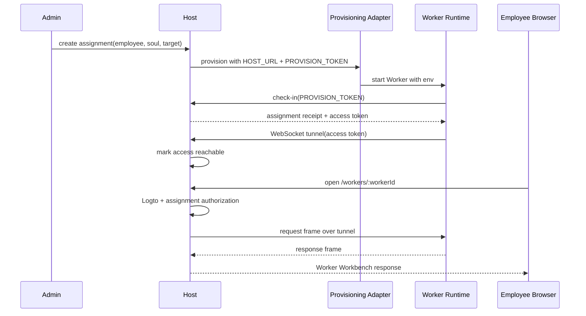

# Phase 2.1 Worker Access Tunnel Design

## Product Goal

Phase 2.1 makes an assigned Worker reachable to its employee through the Host
product URL:

```text
https://aiworker.zonease.org/workers/:workerId
```

The product outcome is simple:

- the administrator sees whether an assigned Worker is actually reachable, not
  only whether a server command succeeded;
- the employee opens one Host URL and reaches their own Worker Workbench;
- the Worker remains locally operable when Host or tunnel access is down.

This phase is not a general gateway project. It is the smallest Worker access
path that makes Phase 2 distribution feel real.

## Non-Negotiable Boundary

`Host-only` applies only to managed employee remote access. It does not mean the
Worker runtime depends on Host for survival.

| Scenario | Entry | Host | Tunnel | Logto + assignment | Purpose |
| --- | --- | --- | --- | --- | --- |
| Employee remote access | `/workers/:workerId` | yes | yes | yes | enterprise product URL |
| Host admin | `/host` | yes | only when opening a Worker | admin role | distribution and status |
| Local operator | localhost Worker Web | no | no | no Host auth | diagnostics and emergency use |
| Standalone/offline | local Worker CLI/Web | no | no | no Host auth | Worker autonomy |

Managed access:

- employee remote access goes through Host, Logto, assignment authorization, and
  the Worker-initiated tunnel;
- Worker does not expose a public employee URL;
- Host reaches Worker only through the Worker-initiated tunnel.

Worker autonomy:

- Worker Web and CLI remain locally operable without Host;
- Host or tunnel outage makes managed remote access unavailable, but does not
  make the Worker runtime unusable;
- localhost Worker Web is diagnostic/local-only and must not be shown as the
  employee-facing product URL.

Host performs transport-level forwarding over a Worker-initiated tunnel. Host
does not mount, iframe, proxy-render, own, or semantically interpret the Worker
Workbench.

## Canonical Docs Promotion

The implementation plan must update the canonical docs before or alongside code:

- `docs/architecture.md`: managed employee access vs local Worker autonomy;
- `docs/protocol.md`: WebSocket-only Worker Access tunnel contract and route
  block;
- `docs/runtime.md`: Worker remains locally operable without Host; tunnel is a
  distribution-plane signal;
- `docs/testing.md`: Phase 2.1 coverage ledger and browser proof requirements.

The wording must distinguish transport-level forwarding from forbidden
proxy-rendering. Tests must pin that `managed access != Worker runtime
dependency`.

## URL And Env Contract

Provisioning target adapters and Worker Access Tunnel are separate.

Adapters own:

- target selection;
- remote deployment;
- startup command;
- delivery of the Host URL and provision token.

Tunnel owns:

- check-in;
- access token receipt;
- WebSocket connection;
- request/response forwarding to the current Worker runtime.

The adapter-provided env contract is intentionally small:

```text
AIWORKER_HOST_URL
AIWORKER_PROVISION_TOKEN
```

Do not add a separate `AIWORKER_WORKER_ACCESS_LOCAL_URL`. That would collide
with fleet and create two sources of truth for the local Worker endpoint.

Local target resolution is a Worker runtime fact:

- preferred: internal Worker daemon handler or app fetch;
- fallback: the current daemon's actual bound host and port;
- fleet continues to own `workerId -> worker home -> daemon port`.

The check-in response carries:

```text
assignment receipt:
  assignmentId
  assignedEmail
  workerId
  soulReleaseRef

access receipt:
  mode = worker_access
  token = tunnel access token
```

The access token is issued by Host after successful check-in. It is not provided
by the adapter and is never returned to the browser.

## Product Flow



## Tunnel Transport

Phase 2.1 uses one transport only:

```text
WebSocket
```

There is no HTTP long-poll fallback. If WebSocket is unavailable, managed Worker
access is unavailable and Host returns a clear not-ready state.

Worker connects to:

```text
GET /api/provision/access
Authorization: Bearer <access token>
Upgrade: websocket
```

Minimal frame types:

- `hello`: bind `workerId`, `assignmentId`, and token validation result;
- `ping` / `pong`: keepalive;
- `request`: Host to Worker HTTP request frame;
- `response`: Worker to Host HTTP response frame;
- `close`: request cancellation, timeout, or tunnel shutdown.

The existing request/response shape remains the base:

```text
request:
  type
  id
  method
  path
  headers
  bodyText

response:
  type
  id
  status
  headers
  bodyText
```

First version uses text frames. Large files, binary streaming, token rotation,
and production backpressure are hardening work, not Phase 2.1 scope.

## Path Mapping

Employee-facing path:

```text
/workers/:workerId/*
```

Worker-local path:

```text
/*
```

Mapping:

```text
/workers/wkr_82              -> /
/workers/wkr_82/             -> /
/workers/wkr_82/assets/app.js -> /assets/app.js
/workers/wkr_82/api/info      -> /api/info
```

The Host must reject absolute URLs, `//host` paths, path escape attempts, and
worker id mismatches.

## Security Boundary

Employee access checks:

1. authenticate Logto session;
2. read employee email;
3. find assignment by `workerId`;
4. require assigned email match;
5. require assignment not revoked or archived;
6. require a valid tunnel connection for that worker;
7. forward only sanitized request frames.

Browser request headers stripped before Worker forwarding:

```text
authorization
cookie
proxy-authorization
set-cookie
x-aiworker-user-email
x-forwarded-user
```

Host may add platform headers such as request id and assignment id, but the first
version should not pass employee email to Worker. Worker should not depend on
employee identity for product authorization.

Host may transmit Worker response bytes to the browser. Host must not parse,
persist, index, or reinterpret Worker Workbench content, session data,
invocation data, projection data, workspace data, or native engine output.

## State Model

Assignment readiness:

```text
provisioning -> checked_in -> access_ready -> ready
                         \-> needs_attention
                         \-> revoked / archived
```

Meaning:

- `provisioning`: assignment and provision token exist; Worker has not checked in;
- `checked_in`: Worker consumed provision token and received an access token;
- `access_ready`: Worker established a valid tunnel;
- `ready`: employee product URL can serve the Worker Workbench;
- `needs_attention`: Worker checked in but tunnel/local Worker Web is unavailable;
- `revoked`: access denied, tokens invalid, tunnel closed;
- `archived`: historical record, not accessible.

The API may compute `ready` from persisted state plus live tunnel state. It must
not show a Worker as employee-ready merely because a provisioning command
reported success.

Failure behavior:

- tunnel down: `/workers/:workerId` returns `503 WORKER_ACCESS_NOT_READY`;
- local Worker Web down: Host returns `502 WORKER_ACCESS_BAD_GATEWAY`;
- assignment mismatch: Host returns `403`;
- missing assignment: Host returns `404`;
- revoked assignment: Host closes the tunnel and rejects reconnect.

## Host Product Shape

Host Web should stay operational and low-noise:

- assignment list shows employee, Soul, target, Worker id, and access state;
- primary employee link appears only when managed access is reachable;
- localhost URL is never shown as the employee product URL;
- failures are plain:
  - `开通中`: provision or check-in not complete;
  - `连接中`: checked in but tunnel not ready;
  - `可访问`: employee URL is ready;
  - `需处理`: tunnel/local Worker Web failed;
  - `已撤销`: assignment revoked.

No Host screen embeds the Worker Workbench. Opening a Worker means navigating to
the Host employee URL, which then uses the tunnel transport.

## Non-Goals

- provisioning target adapter implementation;
- Host port scanning or Worker discovery;
- direct Worker public employee URLs;
- Host mount, iframe, proxy-render, or semantic Workbench ownership;
- HTTP long-poll tunnel fallback;
- multi-tunnel load balancing;
- binary streaming and large file optimization;
- token rotation and production-grade session hardening;
- Cloudflare/Caddy production proof;
- full observability and load testing.

## Testing And Acceptance

Required proof:

- docs contract pins managed access vs Worker autonomy;
- protocol tests validate WebSocket tunnel frames and reject extra fields;
- Host tests cover Logto plus assignment authorization before forwarding;
- Host tests prove revoked assignments cannot connect or reconnect a tunnel;
- Host tests prove `Cookie` and `Authorization` are stripped;
- Worker tests prove check-in must succeed before tunnel connect;
- Worker tests prove tunnel forwarding uses the current Worker runtime context,
  not a provisioning-provided local URL;
- fleet test proves two Workers do not share one local endpoint through env;
- browser proof opens `/workers/:workerId` through Host and reaches Worker-owned
  Workbench content;
- browser proof verifies tunnel down shows a not-ready product state;
- standalone/local Worker tests continue to pass with Host absent.

## Implementation Plan Requirements

The implementation plan must start with canonical docs and guardrail tests. It
must not start by wiring WebSocket code.

Plan order:

1. update canonical docs and docs tests;
2. extend worker-control-protocol frame contract;
3. implement Host tunnel registry and access token validation;
4. implement Worker tunnel client using existing check-in receipt;
5. wire Host `/workers/:workerId/*` forwarding through the tunnel;
6. update Host Web status and employee link behavior;
7. add browser proof for real Host-to-Worker access;
8. run package, contract, browser, and code review verification.
